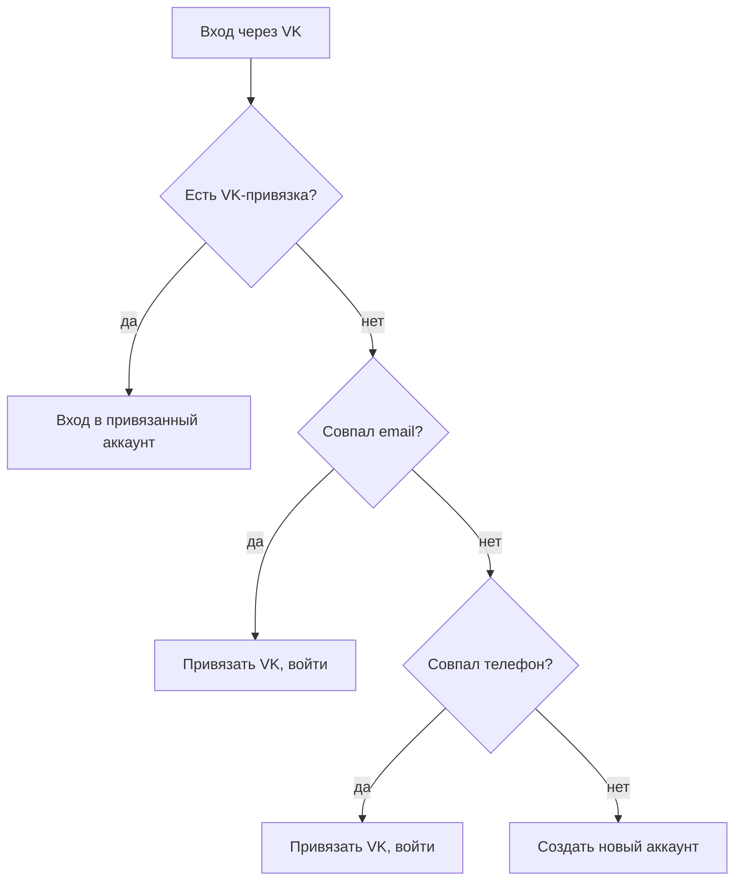

# Регистрация и роли

> Как пользователь регистрируется, входит (в т.ч. через VK) и становится продавцом; какие поля используются; как проверяется имя; как переносятся аккаунты при импорте — со всеми сценариями и рисками. Технические детали — приложение [Техническая справка → Регистрация и авторизация](/processes/auth).

## Назначение и роли

Один аккаунт может быть **покупателем** и **продавцом** одновременно. Покупателем становятся при регистрации; продавцом — отдельной анкетой. Продавать могут только **ЮЛ и ИП** (физлица и самозанятые не поддерживаются).

## Способы входа

- **По телефону** с кодом из SMS (телефон + 6-значный код).
- **По email/паролю**.
- **Через VK** (см. [отдельный раздел](#вход-и-регистрация-через-vk) — там много нюансов).

## Регистрация покупателя

3 шага: данные → подтверждение телефона → пароль.

| Поле | Лейбл | Обяз. | Правила |
|---|---|---|---|
| `last_name` | Фамилия | да | ≤ 60, только буквы (кир./лат.) + пробел/дефис/апостроф |
| `first_name` | Имя | да | то же |
| `city` | Город | да | выбор из справочника |
| `email` | E-mail | да | email, уникальный |
| `phone` | Телефон | да | формат `+7…`, уникальный, **подтверждается кодом из SMS** |
| `password` | Пароль | да | на бэкенде **min 8**, с подтверждением |
| `agreedToTerms` | Согласие с условиями | да | галочка |

Имя покупателя хранится как `«Имя Фамилия»`.

## Регистрация продавца

Продавать могут только ЮЛ (`legal_entity`) и ИП (`sole_proprietor`).

| Поле | Обяз. | Правила |
|---|---|---|
| `legal_form` | да | ЮЛ или ИП |
| `first_name` / `last_name` | да | ФИО, как у покупателя |
| `store_name` | да | ≤ 255, буквы/цифры + `& . , - ' " ! ( ) +` |
| `city` | да | справочник |
| `company_name` | да | полное наименование, ≤ 255 |
| `inn` | да | **10 цифр (ЮЛ) / 12 цифр (ИП)** |
| `kpp` | да (только ЮЛ) | 9 цифр |
| `ogrn` / `ogrnip` | да | 13 цифр (ЮЛ) / 15 цифр (ИП) |
| `legal_address` | нет | ≤ 1000 |
| `email` / `phone` / `password` | да | + подтверждение телефона |

Имя продавца = **название магазина**; личное ФИО — отдельно. Адрес витрины `/u/{slug}` генерируется из названия магазина.

**Стать продавцом** (существующий покупатель): та же анкета реквизитов без повторного ввода ФИО/контактов.

## Как стать продавцом

Продавец регистрируется (реквизиты ЮЛ/ИП) → подключает **выплаты** через анкету в МОНЕТА ([детали](/overview/payouts)) → продаёт. Ручного подтверждения продавца площадкой нет.

## Вход и регистрация через VK

Вход через VK ID (scope запрашивает email и телефон, но пользователь может их не дать). После авторизации в VK система ищет/создаёт аккаунт на портале.

### Порядок сопоставления аккаунта

Строго по приоритету:

1. **По VK-привязке** (VK уже привязан к аккаунту) → вход в этот аккаунт.
2. Иначе **по email** (если VK дал email): аккаунт с таким email → **привязываем VK и входим**.
3. Иначе **по телефону** (если VK дал телефон): аккаунт с таким телефоном → **привязываем VK и входим**.
4. Иначе → **создаётся новый аккаунт** (покупатель).

### Если VK не дал email или телефон

Поля `email`/`phone` в системе обязательны и уникальны, поэтому при отсутствии подставляется **технический плейсхолдер**:

- **Нет email** → синтетический `vk_{id}@social.muzilla.ru`, email считается **неподтверждённым**. Ввод email не запрашивается.
- **Нет телефона** → синтетический `vk_{id}`, телефон **неподтверждён** → пользователя ведут на экран **«Подтвердите телефон»** (`/auth/complete-phone`).
- Позже, при следующем входе через VK, если пользователь даст реальный email/телефон, плейсхолдер **автоматически заменяется** на настоящий (если он не занят другим аккаунтом) и помечается подтверждённым.

### Как тестировать VK

| Сценарий | Ожидаемый результат |
|---|---|
| Первый вход через VK с email и телефоном | Создан аккаунт, оба поля подтверждены, вход |
| Вход через VK без телефона | Создан аккаунт, редирект на «Подтвердите телефон» |
| Вход через VK без email | Создан аккаунт с синтетическим email, вход |
| Повторный вход тем же VK | Вход в тот же аккаунт (без дублей) |
| VK-email совпал с существующим аккаунтом (без VK) | VK привязан к нему, вход в него |
| Аккаунт уже с другим VK | Вход заблокирован (`email_conflict`/`phone_conflict`) |

## Валидация имени (ФИО и название магазина)

| Проверка | ФИО (`PersonName`) | Магазин (`StoreName`) |
|---|---|---|
| Длина | ≤ 60 | ≤ 255 |
| Разрешено | буквы (кир./лат.), пробел, дефис, апостроф | буквы, цифры, пробел, `& . , - ' " ! ( ) +` |
| Запрещено | цифры, эмодзи, пунктуация | эмодзи, управляющие символы |

Правила применяются на регистрации и при смене имени (покупатель и продавец), одинаково на фронте и бэке.

## Импорт пользователей со старого портала

Пользователи и продавцы переносятся из legacy-портала (Yii2 MySQL) командами `migrate-old:*` (пользователи и продавцы — одна таблица, признак `is_seller`). Отдельно переносятся VK/Mail.ru-привязки (`migrate-old:oauth`), блок-листы, отзывы, избранное/корзина/коллекции.

### Как сопоставляются поля

| Было (legacy) | Стало | Правило |
|---|---|---|
| `fio` | `first_name` + `last_name` | 1 слово → имя; 2+ → «Имя Фамилия»; отчество (3-й токен) отбрасывается; префикс юрлица (ООО/ИП/…) → пусто. Сырое ФИО сохраняется в отдельное поле |
| `username`/`fio` | `name` | продавец → название магазина; покупатель → «Имя Фамилия» |
| `phone` | `phone` | нормализация в `+7…`; короче 10 цифр → отбрасывается |
| `email` | `email` | trim/lowercase, валидные; иначе отбрасывается |
| `password_hash` | `password` | переносится как есть (bcrypt); нет → доступ только через сброс пароля |
| `is_seller` | `registration_type`, `is_seller` | продавец/покупатель |
| статус подтверждения в legacy | `phone_verified_at` / `email_verified_at` | подтверждённые в старой системе аккаунты помечаются подтверждёнными |

### Сценарии и нюансы

- **Идемпотентность:** повторный прогон обновляет уже перенесённые записи (ключ — `legacy_id`), дубли не создаются.
- **Мигрированные продавцы не могут сразу продавать:** импорт не создаёт профиль продавца и ставит право продавать в «выкл» — все продавцы обязаны заново пройти верификацию в новой системе. Реквизиты (ИНН/ОГРН/КПП) и привязка к МОНЕТА при импорте **не переносятся**.
- **Валидация обходится:** импорт пишет напрямую в БД, правила имени (whitelist символов) **не применяются** — legacy-ФИО и названия магазинов попадают как есть (могут содержать что угодно из старой базы).
- **VK-привязки:** переносятся, и при будущем входе через VK импортированный пользователь опознаётся по VK-привязке (шаг 1 алгоритма), минуя матчинг по email/телефону.

::: warning Внимание — ошибки импорта и как их решать
| Ситуация | Что происходит | Как решать |
|---|---|---|
| Email/телефон legacy-аккаунта **совпал с уже существующим** (не-legacy) пользователем | Конфликтное поле обнуляется; если не осталось ни email, ни телефона — запись **пропускается** (в лог: «collision») | Разобрать вручную по логу миграции (`storage/logs/migration/`); при необходимости — объединить/скорректировать аккаунт |
| Legacy-аккаунт **без email и без телефона** | Пропускается («no email/phone») | Такие аккаунты не переносятся — решить, нужны ли они |
| Кривой формат телефона/даты/email | Нормализуется или обнуляется, запись не падает | Проверить по логу, поправить в старой базе до повторного прогона |
| VK-привязка не сматчилась при входе (старый VK-id ≠ новый VK ID) | Пользователь пойдёт по матчингу email/телефон (со всеми рисками раздела VK) | Зависит от данных VK; при массовой проблеме — сверка/трансляция id |
:::

## Правила и особенности

- Гостю недоступен личный кабинет; авторизованному — страницы входа/регистрации (редирект).
- На стенде email приходит на реальную почту (SMTP), SMS — через боевой сервис SMS-рассылки.

## Сценарии тестирования

Полная карта проверок авторизации. VK-специфичные — в [разделе VK](#как-тестировать-vk); ниже — регистрация, подтверждение телефона, вход, валидация, роли, включая сложные ситуации.

**Окружение:** стенд `dev.muzilla.ru`. Доступы — по запросу.

### Регистрация покупателя

| Сценарий | Шаги | Ожидаемый результат |
|---|---|---|
| Happy path | Заполнить ФИО/город/email/телефон → подтвердить код → пароль → согласие | Аккаунт создан, вход в ЛК |
| Дубль email | Указать уже занятый email | Ошибка «email занят» |
| Дубль телефона | Указать уже занятый телефон | Ошибка «телефон занят» |
| Кривой телефон | Ввести не `+7…` / короткий | Ошибка формата |
| Пароль ≠ подтверждение | Разные пароль и повтор | Ошибка «пароли не совпадают» |
| Без согласия | Не поставить галочку условий | Кнопка недоступна / ошибка |
| Без подтверждённого телефона | Пропустить шаг кода | Фронт не даёт продолжить без подтверждённого телефона |

### Подтверждение телефона

| Сценарий | Шаги | Ожидаемый результат |
|---|---|---|
| Верный код | Ввести 6 цифр из SMS | Телефон подтверждён (авто-проверка при 6 цифрах) |
| Неверный код | Ввести неправильные 6 цифр | Ошибка, попытка не засчитана |
| Истёкший код | Подождать срок жизни кода, ввести | Ошибка «код истёк» |
| Повторная отправка | «Отправить снова» | Новый код с кулдауном (проверить корректность таймера — без «подождите N тысяч секунд») |

### Регистрация продавца

| Сценарий | Шаги | Ожидаемый результат |
|---|---|---|
| ЮЛ — полный набор | ЮЛ + ИНН(10) + КПП(9) + ОГРН(13) + наименование | Профиль продавца создан; для продаж нужно заключить договор с МОНЕТА |
| ИП — полный набор | ИП + ИНН(12) + ОГРНИП(15) | Профиль продавца создан; для продаж нужно заключить договор с МОНЕТА |
| ЮЛ без КПП/ОГРН | Пропустить обязательные для ЮЛ | Ошибка валидации |
| ИНН неверной длины | ИНН ≠ 10/12 цифр | Ошибка |
| Физлицо/самозанятый | Попытаться выбрать ФЛ | Недоступно (только ЮЛ/ИП) |
| Стать продавцом | Существующий покупатель → анкета реквизитов | Профиль продавца создан, ФИО/контакты из профиля |

### Вход

| Сценарий | Шаги | Ожидаемый результат |
|---|---|---|
| Email + пароль | Верные креды | Вход |
| Неверные креды | Неправильный пароль | Ошибка без утечки существования аккаунта |
| Вход по SMS | Телефон + код | Вход без пароля |
| Сброс пароля (SMS/email) | Запросить код, сбросить | Пароль изменён, вход по новому |
| Защита гостя | Открыть `/profile` без входа | Редирект на вход |
| Защита авторизованного | Открыть `/login` авторизованным | Редирект из входа |

### Валидация имени

| Ввод | ФИО | Название магазина |
|---|---|---|
| «Анна-Мария», «Д'Артаньян», «van der Berg» | ✅ | ✅ |
| Цифры / эмодзи / лишняя пунктуация | ❌ | частично (магазину разрешены цифры и `& . , - ' " ! ( ) +`) |
| Длиннее лимита (ФИО 60 / магазин 255) | ❌ | ❌ |
| Смена имени в профиле | те же правила | те же правила |

### Роли и права

| Сценарий | Ожидаемый результат |
|---|---|
| Переключение Покупатель/Продавец в кабинете | Меняется набор разделов |

## Техническая часть

Endpoint'ы, Form Request'ы, правила имени, VK-сопоставление (`SocialAuthService::findOrCreateFromVk`), команды импорта `migrate-old:*` — приложение [Техническая справка → Регистрация и авторизация](/processes/auth). Анкета МОНЕТА — [Выплаты продавцам](/overview/payouts).
