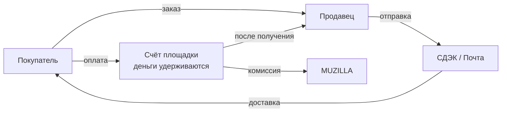

# Обзор проекта

> Весь флоу MUZILLA простым языком — что за площадка, кто участники, как двигаются товар и деньги. Дальше — постранично по разделам: что где находится и как себя ведёт. Технические детали (методы, хранение, команды) — в [Технической документации](/processes/).

## Что за площадка

MUZILLA — маркетплейс музыки: винил, CD, кассеты, Hi-Fi. Продают и покупают сами пользователи (модель C2C), а площадка обеспечивает витрину, безопасную оплату и доставку. Каталог товаров дополнен большой **дискографией** (артисты, релизы, лейблы) из внешней базы Discogs.

## Участники

| Роль | Что делает |
|---|---|
| **Покупатель** | Ищет товары, кладёт в корзину, оформляет и оплачивает заказ, получает и подтверждает |
| **Продавец** | Выставляет товары, подтверждает заказы, отправляет, получает выплаты |
| **Площадка** | Витрина, приём оплаты, удержание денег до получения товара, выплата продавцу, поддержка |
| **Партнёры** | Платёжная система (МОНЕТА), доставка (СДЭК, Почта России), каталог (Discogs) |

## Как двигаются товар и деньги

Главное про безопасную сделку: деньги покупателя **не идут напрямую продавцу**. Они удерживаются на счёте площадки и выплачиваются продавцу только после того, как покупатель получил товар. Если сделка не состоялась — деньги возвращаются покупателю. Подробнее — в разделе [Заказы и статусы](/overview/orders).

## Процессы (постранично)

| Раздел | О чём |
|---|---|
| [Регистрация и роли](/overview/auth) | Вход по телефону/VK, роли покупатель/продавец |
| [Дискография](/overview/discography) | Каталог артистов, релизов, мастеров, лейблов |
| [Каталог / маркетплейс](/overview/marketplace) | Товары на продажу, сортировки и фильтры |
| [Карточка товара](/overview/product) | Что показано в товаре, действия покупателя |
| [★ Работа с товарами](/overview/seller-products) | Продавец: добавление, карточка, фото, статусы |
| [Корзина и оформление](/overview/cart-checkout) | Выбор товаров, доставка, оплата |
| [★ Заказы: жизненный цикл](/overview/orders) | Полный путь заказа, статусы, защитные окна |
| [Оплата](/overview/payment) · [Доставка](/overview/delivery) · [Выплаты](/overview/payouts) | Деньги и логистика |
| [Отзывы](/overview/reviews) · [Сообщения](/overview/messages) | Обратная связь и переписка |
| [Личный кабинет покупателя](/overview/buyer-account) · [Кабинет продавца](/overview/seller-account) | Разделы кабинетов |

Справочно: [Справочник статусов](/overview/statuses) · [Глоссарий](/overview/glossary).

Каждая страница процесса внизу ссылается на соответствующую [Техническую справку](/processes/).
