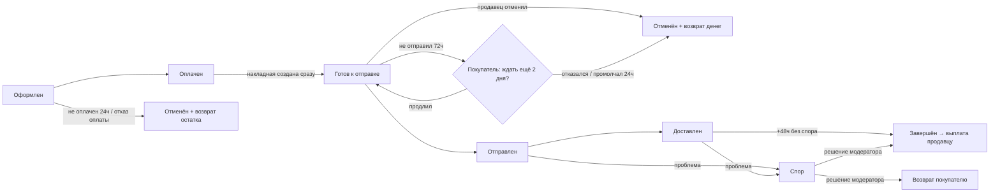

# Заказы: жизненный цикл

> Полное описание того, как живёт заказ на MUZILLA — от оформления до завершения, отмены или возврата. Ключевой процесс площадки; описан максимально подробно для согласования флоу и тестирования.
> Технические детали (endpoint'ы, джобы, события) — в приложении [Техническая справка → Жизненный цикл заказа](/processes/order-lifecycle).

## Назначение и роли

Заказ — покупка товаров **одного продавца**. Если в корзине товары разных продавцов, при оформлении создаётся **отдельный заказ на каждого продавца**; оплачиваются они вместе, одним платежом (объединены общим идентификатором платежа).

| Роль | Что делает с заказом |
|---|---|
| **Покупатель** | Оформляет, оплачивает, получает и подтверждает; при проблеме открывает спор |
| **Продавец** | Получает оплаченный заказ с готовой накладной, отправляет или отменяет; участвует в споре |
| **Площадка** | Держит деньги на своём счёте до получения, следит за сроками, инициирует выплату/возврат |
| **Модератор** | Разбирает споры (решение в пользу покупателя или продавца) |

## Общая схема

Главный принцип: **деньги покупателя удерживаются на счёте площадки** и уходят продавцу только после получения товара и защитного периода. Не сложилось — возвращаются покупателю.

## Пошаговый флоу

### 1. Оформление

Покупатель на [оформлении](/overview/cart-checkout) выбирает товары, доставку и адрес, вводит данные получателя. Создаётся заказ (по одному на продавца) в статусе **«На рассмотрении»**, товар **резервируется** (остаток уменьшается сразу), инициируется оплата. Покупателю и каждому продавцу уходит уведомление о создании заказа.

### 2. Оплата

Покупатель платит картой или через СБП. Деньги поступают на счёт площадки, заказ сразу переходит в **«Готов к отправке»**: площадка сама формирует накладную перевозчика (QR/этикетку), а продавцу **включается таймер 72 часа** на передачу посылки. Подробнее — [Оплата](/overview/payment).

- **Оплата не прошла** (отказ) → заказ сразу отменяется, резерв товара возвращается (✅).
- **Оплата не начата / брошена** → заказ отменяется автоматически через 24 часа, резерв возвращается (✅).

### 3. Отправка продавцом (окно 72 часа)

Отдельного шага «подтвердить заказ» нет: продавец сразу видит заказ с готовой накладной и либо **отправляет** посылку, либо **отменяет** заказ. Пока посылка не сдана, приходят напоминания через **24, 48 и 60 часов**.

**Что если 72 часа истекли.** Заказ не отменяется автоматически — решение принимает покупатель. Ему приходит вопрос: «Мы узнаем у продавца, когда он сможет отправить заказ. Готовы подождать ещё 2 дня?» — с кнопками «Продлить ожидание» и «Отмена заказа» (в кабинете и прямо в письме).

- **Продлил ожидание** → продавцу уходит письмо «Покупатель ожидает заказ №…, у вас есть 48 часов, чтобы отправить товар пользователю» с кнопкой «Отмена заказа». Не отправил и не отменил за эти 48 часов → авто-отмена, покупателю письмо «Ваш заказ автоматически отменен» (✅).
- **Отменил заказ** → отмена с возвратом (✅).
- **Не ответил за 24 часа** → авто-отмена с возвратом и тем же письмом (✅).
- **Продавец отменил сам** (в любой момент до сдачи посылки) → отмена с возвратом (✅).

### 4. Отправка → доставка → завершение

Продавец передаёт посылку в пункт приёма; отметку об отправке ставит не он, а перевозчик — статус **«Отправлен»** появляется, когда груз принят, и покупатель получает трек-номер. Статус доставки обновляется автоматически (система опрашивает перевозчика): «В пути» → «Прибыло в ПВЗ» → **«Доставлен»**. Через **48 часов после доставки** без спора заказ автоматически переходит в **«Завершён»**, и площадка инициирует **выплату продавцу** (стоимость товаров + доставка, за вычетом комиссии площадки). Покупателю открывается [отзыв](/overview/reviews).

## Деньги и комиссии по заказу

Кто сколько платит и когда (подробно, с примерами и ставками — в разделе [Комиссии](/overview/commissions)):

| Момент | Что происходит с деньгами |
|---|---|
| Оформление | Фиксируется комиссия площадки (считается с товаров, не с доставки) |
| Оплата | Покупатель платит **товары + доставка**. Карта — сумма **холдируется** (резервируется на карте); СБП — списывается сразу |
| Приёмка посылки перевозчиком | Захолдированная сумма **списывается** и поступает на транзитный счёт площадки |
| Отправка / доставка | Деньги остаются на транзите |
| Завершение (+48 ч) | Продавцу выплачивается **стоимость товаров за вычетом комиссии площадки** |
| Отмена / возврат | Покупателю возвращается **полная сумма**. Карта до отправки — снятие холда; после списания и любой СБП — с издержками для площадки ([подробнее](/overview/commissions#издержки-площадки-при-возвратах)) |

**Комиссия площадки:** условно **10%** от стоимости товаров (размер не утверждён; будет **не менее 5%**) — подробнее в [Комиссиях](/overview/commissions).

## Уведомления

Уведомления приходят по каналам, которые пользователь включил в **Настройки → Уведомления** (категории × каналы): **Email**, **В приложении**, **Telegram**, **MAX**. По умолчанию включены Email и «В приложении»; Telegram/MAX работают только после привязки аккаунта. Часть критичных уведомлений («готово к отправке», напоминания об отправке, вопрос об ожидании, авто-отмена) **дублируется на email всегда**, даже если каналы выключены.

| Момент | Кому | Повод | Категория | Email гарантирован |
|---|---|---|---|---|
| Заказ оформлен | Покупатель | Заказ создан | Заказы | нет |
| Заказ оформлен | Продавец | Поступил новый заказ | Заказы | нет |
| Оплата прошла | Покупатель | Заказ оплачен | Заказы | нет |
| Оплата прошла | Продавец | Готово к отправке (QR/накладная), 72 ч на передачу посылки | Заказы | **да** |
| 24 / 48 / 60 ч без отправки | Продавец | Напоминание сдать посылку | Заказы | **да** |
| 72 ч без отправки | Покупатель | «Готовы подождать ещё 2 дня?» — кнопки «Продлить ожидание» / «Отмена заказа» | Заказы | **да** |
| Покупатель продлил | Продавец | «Покупатель ожидает заказ, у вас есть 48 часов» + кнопка «Отмена заказа» | Заказы | **да** |
| Авто-отмена по срокам | Покупатель | «Ваш заказ автоматически отменен» | Заказы | **да** |
| Продавец отправил | Покупатель | Заказ отправлен, трек-номер | Заказы | нет |
| Прибыло в ПВЗ | Покупатель | Заказ в пункте выдачи | Заказы | нет |
| Доставлено | Покупатель | Заказ доставлен | Заказы | нет |
| Завершён (48 ч) | Покупатель **и** продавец | Заказ завершён | Заказы | нет |
| Отменён | Покупатель **и** продавец | Заказ отменён | Заказы | нет |
| Выплата инициирована | Продавец | Выплата запущена | Выплаты | нет |

## Все сценарии

Перечень возможных исходов заказа и что при каждом происходит (тесты по ним — [ниже](#сценарии-тестирования)).

| Сценарий | Что происходит | Деньги | Остаток | Статус |
|---|---|---|---|---|
| **Успешный** | Оплата → накладная → отправка → доставка → +48 ч | Продавцу (минус комиссия) | списан | ✅ |
| **Оплата не прошла** | Отказ оплаты → мгновенная отмена | не списаны | возвращён | ✅ |
| **Заказ не оплачен** | Брошен → авто-отмена через 24 ч | — | возвращён | ✅ |
| **Продавец не отправил, покупатель продлил** | 72 ч → вопрос покупателю → +48 ч продавцу | зависит от исхода | зависит | ✅ |
| **Продавец не отправил, покупатель отказался или промолчал** | 72 ч → вопрос → отказ / молчание 24 ч → авто-отмена | возврат покупателю | возвращён | ✅ |
| **Продавец не уложился в продление** | +48 ч → авто-отмена | возврат покупателю | возвращён | ✅ |
| **Продавец отменил** | Ручная отмена до сдачи посылки | возврат покупателю | возвращён | ✅ |
| **Покупатель отменил** | До отправки | возврат (если оплачен) | возвращён | ✅ |
| **Спор → в пользу покупателя** | Модератор вернул деньги | возврат (полный/частичный) | — | ✅ |
| **Спор → в пользу продавца** | Модератор завершил заказ | продавцу | списан | ✅ |

## Экраны

**«Мои заказы» покупателя** (`/profile/orders`): вкладки «Активные» / «Завершённые», статусы оплаты и заказа, поиск и период; у завершённых — «Оставить отзыв».

**«Заказы (лоты)» продавца** (`/seller/orders`): вкладки «Активные»/«Завершённые», колонки Товар / Сумма / Номер заказа / Оплата / Статус доставки; переход в «Детали заказа» с действием «Отменить заказ» (пока посылка не сдана) и блоком трек-номера/QR.

## Статусы

Полный справочник — [Справочник статусов](/overview/statuses). Кратко:

- **Заказ:** На рассмотрении → Подтверждён → Оплачен → Готов к отправке → Отправлен → Доставлен → Завершён · плюс Отменён / Возврат средств / Спор.
- **Оплата:** Не оплачено · Ожидание · Оплачено · Ошибка · Возврат.
- **Доставка:** Ожидает отправки · Готово к отправке · Отправлено · В пути · Прибыло в ПВЗ · Доставлено · Возврат · Отменено · Ошибка.

## Правила и защитные окна

- **72 часа** на передачу посылки перевозчику после оплаты — дальше решение принимает покупатель (продлить на 2 дня или отменить).
- **24 часа** покупателю на ответ и **48 часов** продавцу после продления — в обоих случаях без результата заказ авто-отменяется с возвратом.
- **48 часов** удержания после доставки — потом выплата продавцу.
- **24 часа** на оплату — иначе неоплаченный заказ авто-отменяется (резерв возвращается).
- **Спор** блокирует авто-завершение и выплату до решения модератора.
- Отмена **до отправки**; после отправки/доставки — только через спор.
- Один заказ — один продавец; заказы одной покупки объединены общим платежом.

---

## Сценарии тестирования

### Сценарий A — заказ не оплачен (брошен)

1. Оформить заказ и **не оплачивать**.
   - *Ожидание:* через **24 часа** заказ авто-отменяется, резерв возвращается (денежного возврата нет — не было оплаты). ✅

### Сценарий B — отмена покупателем

1. Оплатить заказ и до передачи посылки перевозчику **отменить** его под покупателем.
   - *Ожидание:* «Отменён», полный возврат, остаток возвращён, оба уведомлены. ✅

### Сценарий C — продавец не отправил вовремя

1. Оплатить заказ и не сдавать посылку **72 часа**.
   - *Ожидание:* покупателю приходит вопрос «Готовы подождать ещё 2 дня?» с кнопками; заказ НЕ отменяется сам. ✅
2. Нажать «Продлить ожидание».
   - *Ожидание:* продавцу письмо «у вас есть 48 часов» с кнопкой «Отмена заказа», дедлайн отправки сдвинут. ✅
3. Не отправлять ещё 48 часов.
   - *Ожидание:* авто-отмена, полный возврат, покупателю письмо «Ваш заказ автоматически отменен». ✅

### Сводка: что реализовано

| Проверяем | Статус |
|---|---|
| Сквозной успех: оплата, накладная, доставка, завершение, выплата | ✅ |
| Вопрос покупателю по истечении 72ч, продление, авто-отмена по срокам | ✅ |
| Возврат остатка при отказе/брошенном/отменённом | ✅ |
| Полный возврат денег при отмене оплаченного | ✅ |
| Спор и его исходы (модератор) | ✅ |

## Техническая часть

Статусы (enum), переходы (сервис), джобы автоматизации (`CancelUnpaidOrders` 24ч, `ProcessUnshippedOrderDeadlines` 72ч/24ч/48ч, `CheckDeliveryStatus`, `ReleaseDeliveredOrders`), события и уведомления — приложение [Техническая справка → Жизненный цикл заказа](/processes/order-lifecycle).
