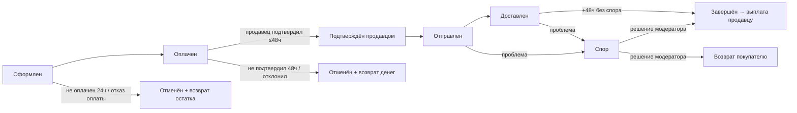

# Заказы: жизненный цикл

> Полное описание того, как живёт заказ на MUZILLA — от оформления до завершения, отмены или возврата. Ключевой процесс площадки; описан максимально подробно для согласования флоу и тестирования.
> Технические детали (endpoint'ы, джобы, события) — в приложении [Техническая справка → Жизненный цикл заказа](/processes/order-lifecycle).

## Назначение и роли

Заказ — покупка товаров **одного продавца**. Если в корзине товары разных продавцов, при оформлении создаётся **отдельный заказ на каждого продавца**; оплачиваются они вместе, одним платежом (объединены общим идентификатором платежа).

| Роль | Что делает с заказом |
|---|---|
| **Покупатель** | Оформляет, оплачивает, получает и подтверждает; при проблеме открывает спор |
| **Продавец** | Подтверждает оплаченный заказ, отправляет; участвует в споре |
| **Площадка** | Держит деньги на своём счёте до получения, следит за сроками, инициирует выплату/возврат |
| **Модератор** | Разбирает споры (решение в пользу покупателя или продавца) |

## Общая схема

Главный принцип: **деньги покупателя удерживаются на счёте площадки** и уходят продавцу только после получения товара и защитного периода. Не сложилось — возвращаются покупателю.

## Пошаговый флоу

### 1. Оформление

Покупатель на [оформлении](/overview/cart-checkout) выбирает товары, доставку и адрес, вводит данные получателя. Создаётся заказ (по одному на продавца) в статусе **«На рассмотрении»**, товар **резервируется** (остаток уменьшается сразу), инициируется оплата. Покупателю и каждому продавцу уходит уведомление о создании заказа.

### 2. Оплата

Покупатель платит картой или через СБП. Деньги поступают на счёт площадки, заказ переходит в **«Оплачен»**, продавцу **включается таймер 48 часов** на подтверждение. Подробнее — [Оплата](/overview/payment).

- **Оплата не прошла** (отказ) → заказ сразу отменяется, резерв товара возвращается (✅).
- **Оплата не начата / брошена** → заказ отменяется автоматически через 24 часа, резерв возвращается (✅).

### 3. Подтверждение продавцом (окно 48 часов)

Продавец видит оплаченный заказ в кабинете и **подтверждает** его — заказ переходит в **«Подтверждён продавцом»**, автоматически формируется отправление (накладная/QR). Пока не подтвердил, приходят напоминания через **3, 6, 24 и 36 часов**.

- **Не подтвердил за 48 часов** → авто-отмена, деньги возвращаются покупателю (✅).
- **Отклонил вручную** → отмена с возвратом (✅).

### 4. Отправка → доставка → завершение

Продавец передаёт посылку и отмечает отправку — статус **«Отправлен»**, покупатель получает трек-номер. Статус доставки обновляется автоматически (система опрашивает перевозчика): «В пути» → «Прибыло в ПВЗ» → **«Доставлен»**. Через **48 часов после доставки** без спора заказ автоматически переходит в **«Завершён»**, и площадка инициирует **выплату продавцу** (стоимость товаров + доставка, за вычетом комиссии площадки). Покупателю открывается [отзыв](/overview/reviews).

## Деньги и комиссии по заказу

Кто сколько платит и когда (подробно, с примерами и ставками — в разделе [Комиссии](/overview/commissions)):

| Момент | Что происходит с деньгами |
|---|---|
| Оформление | Фиксируется комиссия площадки (считается с товаров, не с доставки) |
| Оплата | Покупатель платит **товары + доставка**. Карта — сумма **холдируется** (резервируется на карте); СБП — списывается сразу |
| Подтверждение продавцом | Захолдированная сумма **списывается** и поступает на транзитный счёт площадки |
| Отправка / доставка | Деньги остаются на транзите |
| Завершение (+48 ч) | Продавцу выплачивается **стоимость товаров за вычетом комиссии площадки** |
| Отмена / возврат | Покупателю возвращается **полная сумма**. Карта до подтверждения — снятие холда; после списания и любой СБП — с издержками для площадки ([подробнее](/overview/commissions#издержки-площадки-при-возвратах)) |

**Комиссия площадки:** условно **10%** от стоимости товаров (размер не утверждён; будет **не менее 5%**) — подробнее в [Комиссиях](/overview/commissions).

## Уведомления

Уведомления приходят по каналам, которые пользователь включил в **Настройки → Уведомления** (категории × каналы): **Email**, **В приложении**, **Telegram**, **MAX**. По умолчанию включены Email и «В приложении»; Telegram/MAX работают только после привязки аккаунта. Часть критичных уведомлений (подтверждение продавцом, напоминания, «готово к отправке») **дублируется на email всегда**, даже если каналы выключены.

| Момент | Кому | Повод | Категория | Email гарантирован |
|---|---|---|---|---|
| Заказ оформлен | Покупатель | Заказ создан | Заказы | нет |
| Заказ оформлен | Продавец | Поступил новый заказ | Заказы | нет |
| Оплата прошла | Покупатель | Заказ оплачен | Заказы | нет |
| Оплата прошла | Продавец | Оплачен, подтвердите за 48 ч | Заказы | **да** |
| 3 / 6 / 24 / 36 ч без подтверждения | Продавец | Напоминание подтвердить | Заказы | **да** |
| Продавец подтвердил | Продавец | Готово к отправке (QR/накладная) | Заказы | **да** |
| Продавец отправил | Покупатель | Заказ отправлен, трек-номер | Заказы | нет |
| Прибыло в ПВЗ | Покупатель | Заказ в пункте выдачи | Заказы | нет |
| Доставлено | Покупатель | Заказ доставлен | Заказы | нет |
| Завершён (48 ч) | Покупатель **и** продавец | Заказ завершён | Заказы | нет |
| Отменён | Покупатель **и** продавец | Заказ отменён | Заказы | нет |
| Выплата инициирована | Продавец | Выплата запущена | Выплаты | нет |

## Все сценарии

Перечень возможных исходов заказа и что при каждом происходит (тесты по ним — [ниже](#сценарии-тестирования)).

| Сценарий | Что происходит | Деньги | Остаток | Статус |
|---|---|---|---|---|
| **Успешный** | Оплата → подтверждение → отправка → доставка → +48 ч | Продавцу (минус комиссия) | списан | ✅ |
| **Оплата не прошла** | Отказ оплаты → мгновенная отмена | не списаны | возвращён | ✅ |
| **Заказ не оплачен** | Брошен → авто-отмена через 24 ч | — | возвращён | ✅ |
| **Продавец не подтвердил** | 48 ч → авто-отмена | возврат покупателю | возвращён | ✅ |
| **Продавец отклонил** | Ручное отклонение | возврат покупателю | возвращён | ✅ |
| **Покупатель отменил** | До отправки | возврат (если оплачен) | возвращён | ✅ |
| **Спор → в пользу покупателя** | Модератор вернул деньги | возврат (полный/частичный) | — | ✅ |
| **Спор → в пользу продавца** | Модератор завершил заказ | продавцу | списан | ✅ |

## Экраны

**«Мои заказы» покупателя** (`/profile/orders`): вкладки «Активные» / «Завершённые», статусы оплаты и заказа, поиск и период; у завершённых — «Оставить отзыв».

**«Заказы (лоты)» продавца** (`/seller/orders`): вкладки «Активные»/«Завершённые», колонки Товар / Сумма / Номер заказа / Оплата / Статус доставки; переход в «Детали заказа» с действиями (подтвердить/отправить/отклонить) и блоком трек-номера/QR.

## Статусы

Полный справочник — [Справочник статусов](/overview/statuses). Кратко:

- **Заказ:** На рассмотрении → Подтверждён → Оплачен (ожидает подтверждения продавца) → Подтверждён продавцом → Отправлен → Доставлен → Завершён · плюс Отменён / Возврат средств / Спор.
- **Оплата:** Не оплачено · Ожидание · Оплачено · Ошибка · Возврат.
- **Доставка:** Ожидает отправки · Готово к отправке · Отправлено · В пути · Прибыло в ПВЗ · Доставлено · Возврат · Отменено · Ошибка.

## Правила и защитные окна

- **48 часов** на подтверждение продавцом после оплаты — иначе авто-отмена и возврат.
- **48 часов** удержания после доставки — потом выплата продавцу.
- **24 часа** на оплату — иначе неоплаченный заказ авто-отменяется (резерв возвращается).
- **Спор** блокирует авто-завершение и выплату до решения модератора.
- Отмена **до отправки**; после отправки/доставки — только через спор.
- Один заказ — один продавец; заказы одной покупки объединены общим платежом.

---

## Сценарии тестирования

### Сценарий A — заказ не оплачен (брошен)

1. Оформить заказ и **не оплачивать**.
   - *Ожидание:* через **24 часа** заказ авто-отменяется, резерв возвращается (денежного возврата нет — не было оплаты). ✅

### Сценарий B — отмена покупателем

1. Оплатить заказ и до подтверждения продавцом **отменить** его под покупателем.
   - *Ожидание:* «Отменён», полный возврат, остаток возвращён, оба уведомлены. ✅

### Сводка: что реализовано

| Проверяем | Статус |
|---|---|
| Сквозной успех, оплата, подтверждение, доставка, завершение, выплата | ✅ |
| Возврат остатка при отказе/брошенном/отменённом | ✅ |
| Полный возврат денег при отмене оплаченного | ✅ |
| Спор и его исходы (модератор) | ✅ |

## Техническая часть

Статусы (enum), переходы (сервис), джобы автоматизации (`CancelUnpaidOrders` 24ч, `CancelUnconfirmedPaidOrders` 48ч, `CheckDeliveryStatus`, `ReleaseDeliveredOrders`), события и уведомления — приложение [Техническая справка → Жизненный цикл заказа](/processes/order-lifecycle).
