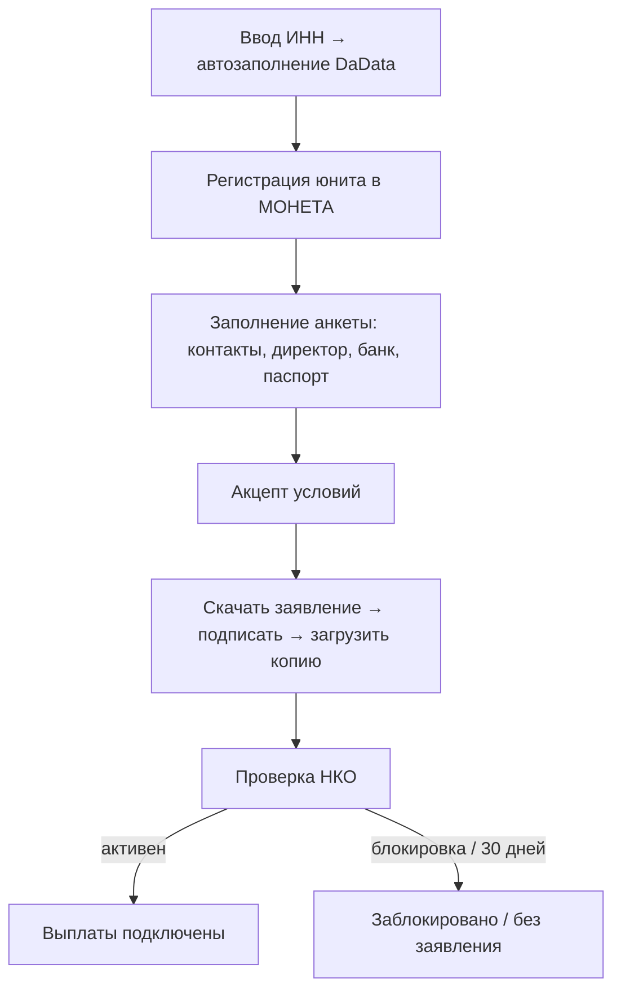

# Выплаты продавцу

> Как продавец подключает выплаты через анкету в НКО МОНЕТА и как площадка переводит ему деньги после завершения заказа. Технические детали — приложение [Техническая справка → Выплаты продавцам](/business/seller-payouts-flow).

## Назначение и роли

Перевод денег продавцу после того, как покупатель получил товар. Всё это время деньги удерживаются на транзитном счёте НКО (счёте площадки). Выплата уходит **счёт→счёт**: с транзита на расчётный счёт продавца (для ЮЛ/ИП).

| Роль | Что делает |
|---|---|
| **Продавец** | Заполняет анкету выплат в МОНЕТА, подписывает договор (заявление о присоединении) |
| **Площадка** | После завершения заказа инициирует выплату за вычетом комиссии |
| **НКО МОНЕТА** | Регистрирует продавца (юнит), проверяет по СМЭВ, открывает счёт, проводит выплаты |
| **DaData** | Только автоподсказка по ИНН (ЕГРЮЛ/ЕГРИП); в НКО ничего не пишет |
| **Поддержка** | Помогает исправить/переоформить анкету, когда самообслуживание закрыто (гейт прав: чтение `sellers.view`, запись `sellers.payments`) |

> **Важно:** подключение выплат — это и есть **допуск к продажам**. Пока продавец не подключил выплаты (не заключил договор с МОНЕТА), он может создавать и вести товары, но они **не публикуются** в каталоге и заказ по ним оформить нельзя. Ручного одобрения продавца администратором нет — продажи открываются автоматически после подключения выплат (как стать продавцом — см. [Регистрация и роли](/overview/auth#как-стать-продавцом)).

## Кто может получать выплаты

Сейчас — **только ЮЛ и ИП** (регистрация юнита в НКО МОНЕТА).

## Анкета подключения выплат (МОНЕТА)

Раздел кабинета **«Подключение выплат»**. Заполняется один раз; данные уходят в НКО МОНЕТА, локально анкета шифруется (поле `payout_setup_data` — `encrypted:array` на APP_KEY; содержит паспорт, расчётный счёт, согласия — наружу через API **не отдаётся**, оно в `$hidden`).

**Поля по шагам:**

- **Автозаполнение по ИНН** — по ИНН из ЕГРЮЛ/ЕГРИП (DaData) подтягиваются наименование, КПП, ОГРН, юр.адрес, ФИО руководителя.
- **Контакты и реквизиты (Personal):** email для финансов и технический, телефоны (поддержки, контактный, бухгалтера), ФИО контакта/бухгалтера, ФИО подписанта договора, почтовый адрес, планируемые обороты, документ полномочий (доверенность / устав / иное), задолженность по налогам (есть/нет), согласия. Для ЮЛ — размер и тип уставного капитала.
- **Руководитель (Director):** ИНН физлица (12 цифр), дата и место рождения, адреса, телефон, резидент РФ (да/нет).
- **Банк:** расчётный счёт (20 цифр) + БИК (9 цифр).
- **Паспорт (руководителя):** серия, номер, дата выдачи, кем выдан, код подразделения.
- **Акцепт условий** — возможен только когда анкета заполнена полностью (МОНЕТА подтверждает, что данных не осталось, либо остался единственный атрибут `CONDITIONS_CORRECT_DATA`).
- **Договор (оферта):** МОНЕТА формирует персональное «Заявление о присоединении» → продавец **скачивает PDF**, подписывает (бумага или ЭЦП Диадок), отправляет оригинал в НКО и **загружает копию** в кабинет.

### Как устроена отправка анкеты (submitAll)

Одна кнопка «Отправить» дёргает главный оркестратор `POST /api/profile/seller/payout-setup/submit-all`, который последовательно выполняет 6–10 SOAP-запросов к МОНЕТА (каждый с таймаутом 15 c, общий лимит скрипта 120 c):

1. Локально сохраняет всю форму в зашифрованное `payout_setup_data` (merge со старой — частичный повтор **не затирает** уже введённое).
2. **CreateProfile** (если юнит ещё не создан) → появляется `moneta_unit_id`, статус договора `REGISTERED`. В НКО улетает минимум: ИНН, краткое наименование, URL, контактный email — остальное НКО тянет по СМЭВ.
3. **CheckProfile** → определяет, какие блоки ещё не заполнены (personal / director / passport / bank).
4. Дозаполняет недостающие блоки: **Personal** (всегда), **Director**, **Passport**, **Bank** (создание + реквизиты — только если блок в списке недостающих и указан счёт).
5. Когда не осталось незакрытых блоков → **акцепт условий** (`CONDITIONS_CORRECT_DATA=Y`) + фиксируется `agreement_signed_at` + **сразу ставится в очередь активация юнита** (`ActivateMonetaUnitJob`).
6. Любая ошибка SOAP → ответ **502** со списком выполненных шагов (`progress[]`); прогресс сохранён, повторная отправка **идемпотентна** (юнит и заполненные блоки не дублируются).

> **Почему активация — сразу, без ручной модерации.** «Заявление о присоединении» НКО формирует только **после** перевода юнита в группу «Активные», а 30-дневный дедлайн на договор тикает с момента регистрации — поэтому активацию нельзя откладывать. Фоновая задача `ActivateMonetaUnitJob` перепроверяет условия готовности и переводит юнит в «Активные», после чего отложенно запускается сверка договора.

## Активация счёта: две независимые дороги

Счёт продавца в НКО может активироваться двумя путями, которые работают параллельно:

- **Вебхук от МОНЕТА** (`POST /webhook/moneta/merchant`) — приходит команда об изменении договора; при переходе в `ACTIVE` и отсутствии счёта НКО-обработчик создаёт счёт и записывает `moneta_account_id`. Идемпотентность — по журналу вебхуков (пара «команда + operation_id»); есть IP-whitelist (если список пуст — принимаются все).
- **Регулярная сверка** `ReconcileMonetaContractsJob` (по расписанию **каждые 30 минут**, без наложений) — сама опрашивает МОНЕТА, маппит группу юнита в статус договора и при активации создаёт недостающий счёт; плюс страхует автоактивацию. Ручной запуск — `php artisan moneta:sync-sellers`.

## Уведомления

| Событие | Уведомление |
|---|---|---|---|
| Выплата **инициирована** (деньги отправлены) | `PayoutInitiatedNotification` («Выплата отправлена, средства поступят в течение 1–3 рабочих дней») |
| Юнит активирован | Уведомление на почту |

## Когда происходит выплата

1. Заказ **доставлен** → взводится срок «доступно к выплате» = момент доставки + **48 часов** (`Order::PAYOUT_HOLD_HOURS = 48`).
2. Раз в час фоновая задача `ReleaseDeliveredOrders` находит доставленные заказы, у которых окно удержания прошло и **нет активного спора** → **завершает заказ** и **инициирует выплату**.
3. Сумма выплаты = **`итог заказа − комиссия площадки`**.
4. **Спор** (статус `DISPUTED`) исключает заказ из выборки → выплата замораживается до решения модератора.
5. Резервный механизм: если срок «доступно к выплате» не был взведён (обработчик доставки не отработал), выборка всё равно поймёт заказ по правилу «доставлен ≥ 48 ч назад».

> Задача работает **раз в час, не поминутно** — фактическая выплата может пройти на 0–59 минут позже расчётного момента.

**Статусы выплаты:** В обработке · Выполнена · Ошибка (повтор по расписанию, до 3 попыток с нарастающей паузой). 

## Статусы подключения

| Статус | Значение | Можно менять |
|---|---|---|
| Не начато | Анкета не начата | да |
| Идёт заполнение | Заполняются контакты/директор/банк/паспорт | да |
| Нужно подписать оферту | Данные заполнены, требуется договор | нет (403) |
| Ждём проверки НКО | Договор отправлен, идёт проверка | нет (403) |
| Активен | Договор активен — можно получать выплаты | нет (403) |
| Заблокировано | НКО заблокировала юнит | да* (перезаполнение после разблокировки) |

После отправки анкеты (статусы «нужно подписать / ждём проверки / активен») продавец **сам менять данные не может** — бэкенд возвращает **403** с текстом «Заявка отправлена (статус: …). Обратитесь в поддержку». Правки — только через поддержку).

## Отказ, блокировка, переподача

| Ситуация | Что происходит | Кто чинит |
|---|---|---|
| Опечатка **до** отправки | Поля редактируемы | продавец сам |
| Опечатка **после** отправки | 403 на запись | **поддержка** правит анкету (`fill-*`/`attach-*`) или регистрирует юнит заново |
| НКО заблокировала (`blocked`) | Выплаты невозможны, деньги копятся на транзите; баннер в кабинете | разбор с НКО / поддержка, повторная подача |
| Заявление не дошло за 30 дней | Юнит «без заявления» (`WITHOUT_AGREEMENT`) | товары продавца снимаются с продажи до получения статуса "Активен" |
| Смена юр.формы (ЮЛ↔ИП) | Через техподдержку | **поддержка**: новая регистрация юнита + новое заявление |

> Пока выплаты не подключены, товары продавца **не публикуются** в каталоге и заказ по ним оформить нельзя — продажи открываются после подключения выплат. Если выплаты **заблокированы уже после** активации, деньги по оформленным ранее заказам копятся на транзите площадки до восстановления.

## Экраны

## Правила и особенности

- **Автозавершение с точностью до часа.** Планировщик `ReleaseDeliveredOrders` — ежечасный; выплата возможна на 0–59 мин позже расчётного момента.
- **Спор блокирует деньги на транзите.** Заказ в статусе `DISPUTED` не попадает в автозавершение — деньги висят на транзите до `release` (в пользу продавца) или `refund` (возврат покупателю).

## Техническая часть

Полный онбординг (регистрация юнита, скоупы, договор, статусы `PayoutSetupStatus`/`MonetaContractStatus`/`PayoutStatus`), вебхуки, сверка договоров, инициация выплаты, точные endpoint'ы и инструменты поддержки — приложение [Техническая справка → Выплаты продавцам](/business/seller-payouts-flow).
