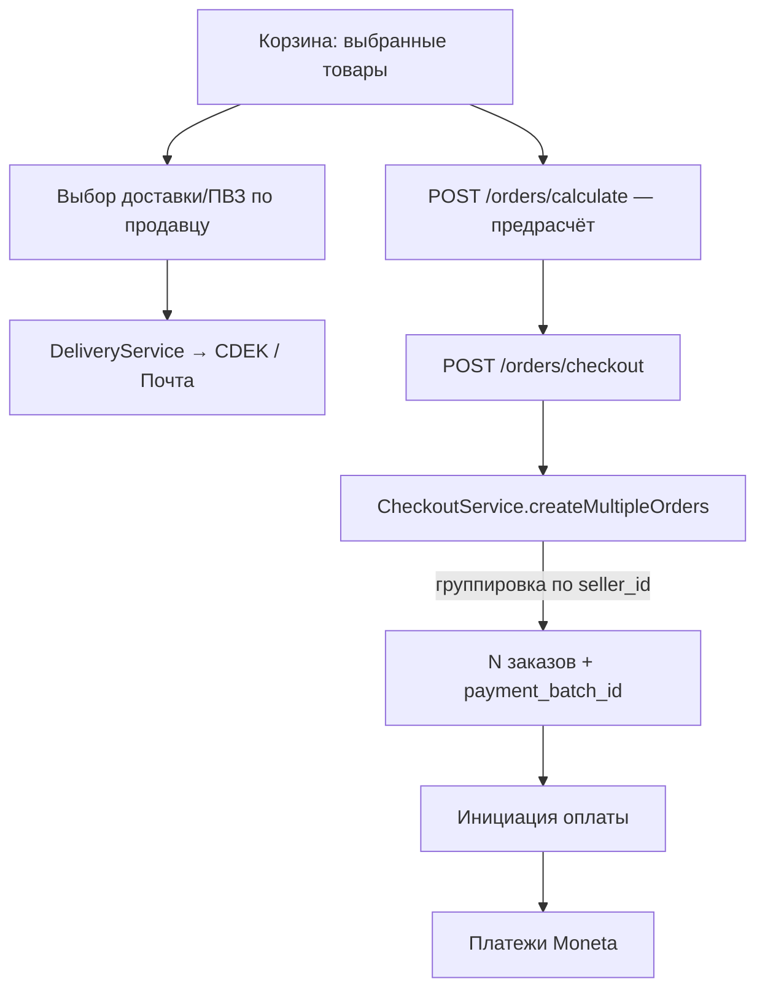

# Оформление заказа (checkout)

> Как товары из корзины превращаются в заказы: выбор товаров, доставка и ПВЗ, адрес получателя, разбивка по продавцам и инициация оплаты. Включает работу корзины на этапе оформления.
> Приоритет: **P0**. Актуально на 2026-09-19.

## Действующие лица

| Актор | Роль |
|---|---|
| **Покупатель** (гость или авторизованный) | Выбирает товары, доставку, вводит получателя, оплачивает |
| **Платформа** (`main`) | Считает стоимость, группирует по продавцам, создаёт заказы, инициирует платёж |
| **Перевозчики** (СДЭК / Почта России) | Расчёт стоимости и сроков, список ПВЗ |
| **DaData** | Подсказки адресов/городов/улиц |

## Где что хранится

| Модель | Что лежит |
|---|---|
| `cart_items` (`CartItem`) | `user_id`, `product_id`, `quantity` (+ вычисляемые `total_price`, `is_available`) |
| `orders` (`Order`) | один заказ = один продавец: `subtotal`, `delivery_cost`, `fee_amount`, `total_amount`, `payment_batch_id`, `pickup_point_id` (откуда уедет посылка), `source='platform'`, `customer_*` |
| `order_items` (`OrderItem`) | позиции + `product_snapshot` (снимок цены/описания на момент заказа) |
| `order_addresses` (`OrderAddress`) | адрес-снимок: ПВЗ (`pickup_point_*`) или курьер (`city`, `address_line1`) |
| `order_shipments` (`OrderShipment`) | `carrier`, `delivery_method`, `cost`, `weight` |

> Ключевой принцип: **один Order на каждого продавца**, все заказы одной корзины объединяются `payment_batch_id` и оплачиваются одним платежом.

## Обзор потока

## Корзина (участвует в оформлении)

Контроллер `Api\CartController`; авторизация — через `CartItem` Policy.

| Метод | Путь | Метод | Назначение |
|---|---|---|---|
| `GET` | `/api/cart` | `index()` | Корзина + summary (`total_price/items/quantity`) |
| `POST` | `/api/cart` | `store()` | Добавить (`AddToCartRequest`; проверка `stock_quantity`) |
| `PATCH` | `/api/cart/{cartItem}` | `update()` | Изменить количество |
| `DELETE` | `/api/cart/{cartItem}` | `destroy()` | Удалить позицию |
| `DELETE` | `/api/cart` | `clear()` | Очистить корзину |
| `POST` | `/api/cart/merge` | `merge()` | Слить гостевую корзину (localStorage) в БД после логина |

**Гостевая корзина** живёт в `localStorage` (`useGuestCart`), при логине `merge()` капит количество `min(existing + guest, stock, 100)`, пропуская удалённые/неактивные/свои товары; ответ `{ merged, skipped }` (идемпотентно). Подробнее о хранилищах — [Корзина и избранное](/processes/cart-wishlist).

## Endpoints checkout

Группа `orders`, контроллеры `Api\Orders\CheckoutController` и `DeliveryController`.

| Метод | Путь | Метод | Назначение |
|---|---|---|---|
| `POST` | `/api/orders/calculate` | `CheckoutController::calculate()` | Предрасчёт: subtotal + delivery + platform_fee (без создания) |
| `POST` | `/api/orders/checkout` | `CheckoutController::process()` | **Создать заказы из корзины** (`throttle:12,1`) |
| `POST` | `/api/orders/delivery/calculate` | `DeliveryController::calculate()` | Стоимость/сроки доставки (один или все перевозчики) |
| `GET` | `/api/orders/delivery/pickup-points` | `DeliveryController::pickupPoints()` | ПВЗ по городу / координатам / bbox карты |
| `GET` | `/api/orders/delivery/courier-options` | `DeliveryController::courierOptions()` | Опции курьерской доставки |
| `POST` | `/api/orders/delivery/track` | `DeliveryController::track()` | Трекинг по номеру |

Валидация: `CalculateOrderRequest`, `CreateOrdersRequest` (методы `getCustomerData()/getOrdersData()/getDeliveryData()`, `courier_address` обязателен при `delivery_method=courier`).

## Создание заказов: `CheckoutService`

`app/Services/Order/CheckoutService.php`, единственный метод, создающий заказы, — `createMultipleOrders($buyer, $ordersData, $customerData, $deliveryData, $duplicateAcknowledged)`. Весь метод выполняется под замком `Cache::lock("checkout:buyer:{id}")`: проверка дубля и коммит заказа — разные запросы, поэтому два одновременных оформления иначе прошли бы проверку оба.

1. `resolveBatchDriver()` — драйвер платежа батча по участникам сделки (`PaymentProviderManager::forParticipants`, роллаут по allowlist покупателей/продавцов): `bpa` (касса агрегатора, чек 54-ФЗ) или `moneta` (историческая схема). Батч попадает в схему целиком.
2. `resolveSellerOrder()` для каждого продавца — серверная проверка: цена из БД, доставка из `DeliveryService`, принадлежность товара продавцу, `canSell()`. При драйвере `bpa` дополнительно фискальный гейт `SellerFiscalReadiness` (счёт в НКО, ИНН, название, телефон) → issue `seller_not_fiscal_ready`. Любая проблема → `CheckoutValidationException` → `422` + `issues`, заказы не создаются. Тот же разбор использует `previewOrders()` (`POST /api/orders/checkout/preview`), поэтому экран подтверждения и созданный заказ не расходятся.
3. `assertNoDuplicateCheckout()` — повтор того же набора товаров у того же продавца за последние `marketplace.checkout.duplicate_window_minutes` (30) отбивается: `DuplicateCheckoutException` → `409` + блок `existing` (батч, номера заказов, `is_payable`). Окно учитывает и **оплаченные** заказы, отменённые — игнорирует. Осознанный повтор проходит по `duplicate_ack: true` в теле запроса.
4. `generatePaymentBatchId()` → `BATCH-YYYYMMDD-HHMMSS-XXXXX` на всю группу.
5. `pricing_model = PaymentProviderManager::pricingModelFor(driver)` (`bpa_v2` / `legacy_flat10`) фиксируется на заказе и больше не меняется: от неё зависят комиссия, база выплаты и драйвер оплаты (`forNewBatch` читает её с заказа).
6. Для каждого продавца создаётся отдельный `Order`:
   - `subtotal = Σ(price × qty)`, `delivery_cost` серверная, `fee_amount = Order::calculatePlatformFeeFor(subtotal, pricing_model)` (в `bpa_v2` — по карточной ставке как максимальной, уточняется при инициации платежа), `total_amount`.
   - `customer_name/phone/email`, `delivery_service`, `payment_batch_id`, `pickup_point_id` (снимок пункта отправки), `source='platform'`, статусы `PENDING`.
   - `OrderItem` с `product_snapshot`, атомарный резерв склада (`decreaseStockAtomically`).
   - `OrderAddress` (ПВЗ: `pickup_point_id/name/data`, извлечение `postal_code`; или курьер: `city`, `address_line1`).
   - `OrderShipment` (`carrier`, `delivery_method`, `cost`, `weight` по весу позиций).
   - запись `OrderStatusHistory` (создан).
7. Уведомления `OrderCreatedForBuyer` / `OrderCreatedForSeller`.
8. Возврат `{ orders, payment_batch_id, notices }` → фронт инициирует [оплату](/processes/payments-moneta).

::: warning Один путь создания заказов
Второго пути быть не должно. До 05.09.2026 рядом жил дубль `createOrdersFromCart()`: выбор драйвера и фискальный гейт были встроены только в него, контроллер его не звал, и заказы получали легаси-модель денег — на проде оплата уходила в историческую схему МОНЕТЫ (ЛК1 без пароля) вместо кассы агрегатора. Дубль удалён; тесты чекаута обязаны ходить через `createMultipleOrders` или `POST /api/orders/checkout`.
:::

::: warning Экран чекаута создаёт заказ при каждом проходе
`handleProceedToPayment()` всегда зовёт `submitOrders()` и только потом `initiatePayment(batchId)`. Любой повторный проход экрана — возврат со шлюза кнопкой «Назад», вторая вкладка, повтор после неудачной оплаты — это ещё один заказ и ещё один батч. 15.09.2026 на проде так возникли две пары дублей, в одной из которых покупатель оплатил один лот дважды (СБП + карта, 78 секунд врозь, возврат вручную).

Защита с 19.09.2026 трёхслойная: замок на покупателя (гонка) → проверка дубля по составу (повтор) → `throttle:12,1` (предохранитель, если кеш недоступен). Фронт дополнительно переиспользует уже созданный батч, если состав корзины не изменился (`lastSubmittedFingerprint` в `useCheckout`), и показывает выбор «оплатить существующий / оформить ещё один» вместо молчаливого создания второго заказа.
:::

## Пункт отправки заказа

`products.pickup_point_id` — «ПВЗ продавца, откуда отправляется товар». До 19.09.2026 это поле не читал никто: и тариф (`DeliveryService::resolveSender`), и заявка СДЭК (`shipment_point`), и дозаполнение `sender_data`, и обратная отправка при возврате брали ПВЗ продавца «по умолчанию» (`User::cdekPickupPoint`, первый `is_default`). У продавца с двумя пунктами это давало и неверный тариф, и заявку из чужого города: 15.09.2026 лоты лежали в Екатеринбурге, а посылка была заявлена из Нижнего Тагила — плюс 100 ₽ к доставке покупателю.

Теперь отправитель резолвится единственным методом `DeliveryService::resolveSenderPoint()`, приоритет: пункт товара/заказа → ПВЗ продавца нужного перевозчика → дефолтный пункт. Флаг `requireCarrierMatch` разводит два разных вопроса: **где лежит товар** (город и индекс для тарифа — от перевозчика не зависит) и **какой код передать перевозчику** (`provider_code` = `shipment_point`, принадлежит конкретному перевозчику).

Пункт фиксируется на заказе (`orders.pickup_point_id`) в момент оформления: тариф считается при checkout, а заявка создаётся позже (при оплате), и за это время привязка товара может измениться.

Один заказ = одна посылка = один отправитель, поэтому товары продавца из **разных** пунктов в один заказ не собираются — issue `mixed_pickup_points` (`422`), оформлять раздельно.

## Доставка на этапе оформления: `DeliveryService`

`app/Services/Order/DeliveryService.php` оркестрирует провайдеров:

- `calculateDeliveryCost($carrier, $from, $to, $weight, ...)` / `calculateAllCarriers(...)` — расчёт по одному или всем.
- `getPickupPoints($city)` / `getPickupPointsByCoordinates($lat,$lon)` (радиус ≤50км) / `getPickupPointsByBounds(bbox)` — три режима поиска ПВЗ; кеш 1–24ч.
- Провайдеры: `CdekProvider` (тариф **136** — ПВЗ→ПВЗ; требует `postal_code`; каталог ПВЗ в `CdekPickupPoint`), `RussianPostProvider` (ОПС, расчёт, оформление, PDF-накладная). Прочие перевозчики — stub (`DeliveryStubData`).

**DaData** (`Api\DaDataController`): `POST /api/dadata/suggest/{address,streets,cities}`, `POST /api/dadata/clean/address`, `GET /api/dadata/postal-unit/suggest` — подсказки/стандартизация адресов (throttle 60/мин).

## Frontend

| Файл | Роль |
|---|---|
| `nuxt/stores/cart.ts` | стор корзины; `deselectedItemIds` (по умолчанию выбрано всё), `selectedItemsBySeller`, `merge()`, `selectOnly()` |
| `nuxt/pages/cart.vue` | страница корзины, галочки выбора |
| `nuxt/pages/checkout.vue` | оформление: блок на продавца, доставка, получатель, оплата |
| `nuxt/components/checkout/*` | `CheckoutOrderBlock`, `CheckoutRecipientForm`, `CheckoutInlineRegister` (гость), `PaymentMethodSelector`, `CheckoutOrderSummary`/`CheckoutMobileBottomBar` |

`handleProceedToPayment()` собирает `deliveryBySeller` + `recipientData` → `POST /orders/checkout` → инициация платежа.

## Что делать, если пошло не так

| Ситуация | Поведение | Кто чинит |
|---|---|---|
| Товар кончился между добавлением и checkout | `is_available=false`, серая секция «Больше не в наличии», исключён из выбора | покупатель (убирает) |
| Пустой выбор при переходе к оплате | guard `hasSelectedItems` + редирект | автоматически (фронт) |
| ПВЗ без индекса | `postal_code` резолвится из `pickup_point_data` / id `rp-XXXXX` | автоматически (`CheckoutService`) |
| Расчёт перевозчика недоступен | fallback на stub-данные (кроме реального API Почты) | автоматически |
| Продавец без фискальных реквизитов при включённой кассе (`bpa`) | `422` + issue `seller_not_fiscal_ready`, заказ не создан; в логе `Checkout: продавец не готов к фискализации` с перечнем `missing` | продавец / админ (реквизиты в НКО) |
| Покупатель повторно проходит экран оплаты | `409` + `existing`, модалка «Такой заказ уже есть»; в логе `Checkout: повторное оформление того же заказа отклонено` | покупатель (оплатить существующий или подтвердить повтор) |
| Два оформления одновременно | второе ждёт замок до 8 с, затем `409` `checkout_in_progress`; в логе `Checkout: параллельное оформление отклонено замком` | покупатель (проверяет «Мои покупки») |
| Товары продавца в разных пунктах отправки | `422` + issue `mixed_pickup_points` | покупатель (оформляет раздельно) |

## Как тестировать

**Приоритет P0.** Автотесты checkout живут в `main/tests/Feature/Orders/CheckoutGuardsTest.php` (цена, остаток, доставка, вес, корзина, дубли, пункт отправки). Ручные сценарии:

1. 2–3 товара от разных продавцов → checkout → заказы разделяются по продавцам, общий `payment_batch_id`.
2. Изменение количества/удаление в корзине → пересчёт summary.
3. ПВЗ: выбор пункта выдачи → корректный `postal_code` и стоимость.
4. Почта России: реальный расчёт стоимости/срока.
5. Курьер: обязателен адрес (`courier_address`), иначе валидация.
6. Гость: инлайн-регистрация в checkout + merge гостевой корзины.
7. Расчёт `platform_fee` и `total_amount` совпадает между `/calculate` и `/checkout`.

**Покрытие:** нет (см. [матрицу покрытия](/testing/coverage-matrix)) — приоритетная цель этапа автотестов: `CartController`, `CheckoutController`.

## Ключевые файлы

| Область | Файл |
|---|---|
| Корзина | `app/Http/Controllers/Api/CartController.php`, `app/Models/CartItem.php`, `app/Http/Requests/Cart/*` |
| Checkout | `app/Http/Controllers/Api/Orders/CheckoutController.php`, `app/Services/Order/CheckoutService.php`, `app/Http/Requests/Order/{CalculateOrderRequest,CreateOrdersRequest}.php` |
| Доставка | `app/Http/Controllers/Api/Orders/DeliveryController.php`, `app/Services/Order/DeliveryService.php`, `app/Services/Delivery/{CdekProvider,RussianPostProvider,DeliveryStubData}.php` |
| DaData | `app/Http/Controllers/Api/DaDataController.php`, `app/Services/DaDataService.php` |
| Frontend | `nuxt/stores/cart.ts`, `nuxt/pages/{cart,checkout}.vue`, `nuxt/components/checkout/*` |
| Модели | `app/Models/Order/{Order,OrderItem,OrderAddress,OrderShipment}.php` |
