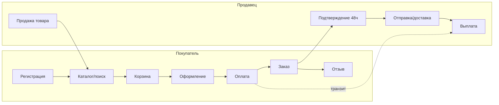

# Техническая справка (приложение)

> Приложение для **разработчиков**: что где вызывается, какие методы, что где хранится, какие [консольные команды](/processes/operations) есть, как что запускать и перезапускать. Сюда ссылаются страницы раздела [Процессы](/overview/orders) из блока «Техническая часть». Каждый документ — по единому шаблону (см. ниже).

## Что это и как читать

Процессный документ отвечает на три вопроса: **что происходит**, **что где вызывается** (endpoint → контроллер → сервис → модель/джоба), и **как это тестировать**.

Приоритеты: **P0** — ядро маркетплейса (деньги/заказы), максимальный приоритет тестирования; **P1** — важные, но не блокирующие оборот.

## Процессы

| # | Процесс | Приоритет |
|---|---|---|
| 1 | [Жизненный цикл заказа](/processes/order-lifecycle) | **P0** |
| 2 | [Оформление заказа (checkout + корзина)](/processes/checkout) | **P0** |
| 3 | [Платежи (Moneta)](/processes/payments-moneta) | **P0** |
| 4 | [Выплаты продавцам](/business/seller-payouts-flow) | P1 |
| 5 | [Регистрация и авторизация](/processes/auth) | P1 |
| 6 | [Каталог и поиск](/processes/catalog-search) | P1 |
| 7 | [Корзина и избранное](/processes/cart-wishlist) | **P0** |
| 8 | [Доставка (СДЭК / Почта)](/processes/delivery) | P1 |
| 9 | [Отзывы](/processes/reviews) | P1 |
| 10 | [Продажа товара продавцом](/processes/seller-listing) | P1 |
| — | [Операции и команды](/processes/operations) | — |

Матрица покрытия автотестами по этим процессам — [Матрица покрытия](/testing/coverage-matrix). Ручные сценарии тестирования — на самих страницах процессов ([Процессы](/overview/orders)).

## Общая карта площадки

## Шаблон процессного документа

Каждый процесс оформляется единообразно (пример — [Выплаты продавцам](/business/seller-payouts-flow)):

1. **Назначение + приоритет + дата актуальности**
2. **Действующие лица** — таблица акторов
3. **Где что хранится** — модели/таблицы/поля
4. **Обзор** — Mermaid-диаграмма (`flowchart` / `sequenceDiagram` / `stateDiagram`)
5. **Статусы** — таблица переходов (где применимо)
6. **Endpoints** — метод + путь + контроллер-метод
7. **Сервисы/джобы/события** — что где вызывается
8. **Что делать, если пошло не так** — recovery-сценарии
9. **Как тестировать** — ключевые проверки + отметка покрытия
10. **Ключевые файлы** — таблица `область → путь`
