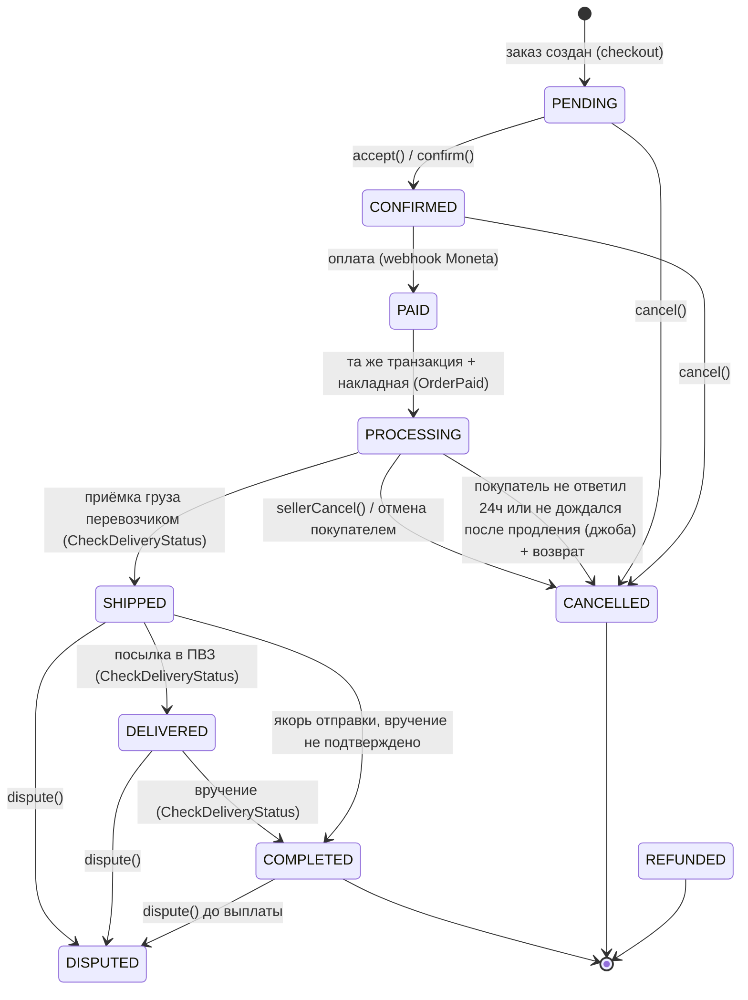

# Жизненный цикл заказа

> Каноничная карта того, как заказ проходит путь от создания до завершения (или отмены): кто и чем двигает статус, какие джобы работают в фоне, какие события и уведомления при этом стреляют.
> Приоритет: **P0** (ядро маркетплейса). Актуально на 2026-09-22.

## Действующие лица

| Актор | Роль в процессе |
|---|---|
| **Покупатель** | Создаёт/подтверждает заказ, оплачивает, при проблеме открывает спор |
| **Продавец** | Получает оплаченный заказ с готовой накладной, отправляет за 72ч либо отменяет, взаимодействует по спору |
| **Платформа** (`main`) | Валидирует переходы (FSM), взводит дедлайны, шлёт уведомления, инициирует выплату |
| **Планировщик** (cron-джобы) | Запрос покупателю по истечении срока отправки, автоотмена по его итогу, автозавершение доставленных, поллинг доставки |
| **Модератор** (админка) | Разрешает споры (`DISPUTED` → завершение/возврат) |

## Где что хранится

| Таблица / модель | Что лежит |
|---|---|
| `orders` (`Order`) | `status`, `payment_status`, `delivery_status` + временны́е метки: `payment_at`, `shipping_deadline_at`, `wait_prompt_sent_at`, `wait_extended_at`, `shipped_at`, `delivered_at`, `payout_eligible_at`, `completed_at`, `cancelled_at`, `disputed_at`; выплата: `seller_payout_amount/at/status/id`; деньги: `moneta_*` |
| `order_status_history` (`OrderStatusHistory`) | `from_status`, `to_status`, `changed_by` (null = автоматический переход), `comment` — журнал каждого перехода |
| `order_shipments` (`OrderShipment`) | отправление: `delivery_method`, `tracking_number`, `qr_code_url`, `qr_pdf_url`, `status`, `tracking_data`, `provider_uuid` |
| `order_items`, `order_addresses`, `order_messages`, `order_complaints` | позиции, адрес-снимок, переписка по заказу, жалобы/споры |

**Шага «подтвердить заказ» нет.** Оплата сразу переводит заказ в `PROCESSING` и создаёт накладную перевозчика — продавец получает заказ готовым к отправке.

Окна: передача посылки перевозчику — **72 ч от оплаты** (`orders.shipping_deadline_at`, `config/marketplace.php → shipping.deadline_hours`). По истечении заказ НЕ отменяется: у покупателя спрашивают, готов ли он ждать ещё 2 дня, и ответа ждут **24 ч** (`marketplace.wait.response_hours`). Продление даёт продавцу ещё **48 ч** (`marketplace.wait.extension_hours`) и сдвигает `shipping_deadline_at`; продление одноразовое. Удержание денег — `min(shipped_at + 24д, delivered_at + 17д)`, задаётся в `config/marketplace.php → payout` (`Order::computePayoutEligibleAt()`).

**Холд карты списывается при приёмке посылки перевозчиком** (`CaptureHoldOnShipped` на `OrderShipped`), а не при оплате: пока груз не сдан, отмена закрывается снятием холда — бесплатно, в отличие от возврата.

**Отметку об отправке ставит перевозчик, не продавец.** Ручной кнопки «Заказ отправлен» больше нет (роут `POST /api/orders/{order}/ship` удалён): `shipped_at` проставляет `CheckDeliveryStatus` по факту приёмки груза, а у СДЭК заведённая заявка (`CREATED`/`ACCEPTED`) считается `AWAITING_SHIPMENT`, а не отправкой. Ручной перевод в `SHIPPED` остался только у администратора (`OrderService::markShippedManually()`, админский `updateStatus`) — на случай, когда перевозчик молчит.

## Обзор жизненного цикла

## Статусы заказа (`App\Enums\OrderStatus`)

| Статус | Значение | Лейбл (UI) | Смысл |
|---|---|---|---|
| `PENDING` | `pending` | На рассмотрении | Заказ создан, ждёт подтверждения |
| `CONFIRMED` | `confirmed` | Подтвержден | Ожидается оплата |
| `PAID` | `paid` | Оплачен | Транзиентный: `markAsPaid()` сразу двигает в `PROCESSING`. Задержаться тут заказ может, только если упало создание накладной |
| `PROCESSING` | `processing` | Готов к отправке | Накладная создана, посылка ещё не принята перевозчиком; передать её нужно до `shipping_deadline_at` (72ч от оплаты, +48ч при продлении) |
| `SHIPPED` | `shipped` | Отправлен | Передан в доставку |
| `DELIVERED` | `delivered` | Доставлен | Посылка в пункте выдачи, ждёт получателя |
| `COMPLETED` | `completed` | Завершен | Покупатель забрал заказ. Статус витринный: деньги продавцу разблокируются отдельно, по окончании окна удержания |
| `CANCELLED` | `cancelled` | Отменен | Отменён (в т.ч. автоотмена) |
| `REFUNDED` | `refunded` | Возврат средств | Выполнен возврат |
| `DISPUTED` | `disputed` | Спор | Ждёт решения модератора |

Правила переходов зашиты в методы enum: `isFinal()` (`COMPLETED/CANCELLED/REFUNDED`), `isCancellable()` (`PENDING/CONFIRMED/PAID/PROCESSING`; `Order::isCancellable()` добавляет к `PROCESSING` условие «посылка не сдана»), `isCancellableByAdmin()` (то же без этого условия — поддержке нужно закрывать и уехавшие заказы), `canBuyerDispute()` (`SHIPPED/DELIVERED`; полное правило — `Order::canBuyerDispute()`: в `COMPLETED` спор доступен, пока выплата не инициирована), `canBuyerReview()`/`allowsProductReview()` — см. [Отзывы](/processes/reviews).

Отдельные enum'ы: `PaymentStatus` (`pending/processing/completed/failed/cancelled/refunded`), `DeliveryStatus` (`pending/awaiting_shipment/shipped/in_transit/arrived/delivered/returned/cancelled/error`).

## Endpoints

Группа `Route::middleware(['auth:web', EnsurePhoneIsVerifiedApi])->prefix('orders')`, контроллер `Api\Orders\OrderController`.

| Метод | Путь | Контроллер | Переход |
|---|---|---|---|
| `GET` | `/api/orders` | `index()` | — (список по роли buyer/seller) |
| `GET` | `/api/orders/{order}` | `show()` | — (детали + все связи) |
| `POST` | `/api/orders/{order}/confirm` | `confirm()` | `PENDING → CONFIRMED` (покупатель) |
| `POST` | `/api/orders/{order}/accept` | `accept()` | `PENDING → CONFIRMED` (продавец) |
| `POST` | `/api/orders/{order}/seller-cancel` | `sellerCancel()` | `PROCESSING → CANCELLED` + возврат (пока посылка не сдана) |
| `POST` | `/api/orders/{order}/extend-wait` | `extendWait()` | продление ожидания покупателем: `+48ч` к `shipping_deadline_at` |
| `GET` | `/api/orders/{order}/wait-action/{action}` | `OrderWaitActionController` | подписанная ссылка из письма: `extend-wait` / `buyer-cancel` / `seller-cancel` |
| `POST` | `/api/orders/{order}/cancel` | `cancel()` | `→ CANCELLED` (возврат склада/денег) |
| `POST` | `/api/orders/{order}/dispute` | `dispute()` | `SHIPPED/DELIVERED → DISPUTED` |

Оплата приходит только вебхуком Moneta — см. [Платежи](/processes/payments-moneta). Stub-эндпоинт `POST /api/orders/{order}/pay` удалён 26.09.2026: он был открыт на проде и переводил заказ в оплаченный без денег (с накладной и окном отправки для продавца).

Доступ к этим эндпоинтам — только участникам заказа, решает `OrderPolicy`. Ролевые права, включая `super-admin`, на заказы не распространяются (`Gate::before` пропускает заказы мимо себя): чужой заказ смотрят в админке, `/api/admin/orders/{id}` с `can:orders.view`.

## Переходы: сервис `OrderService`

`app/Services/Order/OrderService.php` — единственная точка смены статуса (пишет `OrderStatusHistory`, диспатчит события):

| Метод | Переход | Побочный эффект |
|---|---|---|
| `markAsPaid()` | `CONFIRMED → PAID → PROCESSING` | `shipping_deadline_at = payment_at + 72ч`, две записи в истории; событие `OrderPaid` → создание отправления. Из кода приложения не вызывается (вебхук проводит оплату сам в `PaymentService`), используется тестами |
| `sellerCancelOrder()` | `PROCESSING → CANCELLED` | возврат денег + отмена заявки перевозчику |
| `promptBuyerForWaitDecision()` | — (остаётся `PROCESSING`) | ставит `wait_prompt_sent_at`, шлёт покупателю вопрос об ожидании |
| `extendBuyerWait()` | — (остаётся `PROCESSING`) | `wait_extended_at`, `shipping_deadline_at = now + 48ч`, сброс стадии напоминаний, письмо продавцу |
| `markShippedManually()` | `PROCESSING → SHIPPED` | только админ; заполняет `shipped_at` у заказа и отправления, событие `OrderShipped` |
| `autoCancelUnshippedOrder()` | `PAID/PROCESSING → CANCELLED` | вызывается джобой: покупатель промолчал, продление истекло или доживает холд. Шлёт покупателю «Ваш заказ автоматически отменен» |
| `cancelOrder()` | `* → CANCELLED` | возврат товаров на склад + денег (если деньги получены) |
| `cancelOrderByAdmin()` | `* → CANCELLED` | то же, но разрешён и `PROCESSING` |
| `openDisputeByBuyer()` | `SHIPPED/DELIVERED → DISPUTED` | создаёт `OrderComplaint` |

## Фоновая автоматизация (джобы + расписание)

Расписание — `main/routes/console.php`.

| Джоба | Частота | Что делает |
|---|---|---|
| `SendUnshippedOrderReminders` | каждый час | напоминания продавцу о несданной посылке (24/48/60ч от оплаты; после продления отсчёт заново, антидубль по `shipping_reminder_stage`) |
| `ProcessUnshippedOrderDeadlines` | каждый час | ведёт весь сценарий дедлайна: запрос покупателю по истечении `shipping_deadline_at`; автоотмена при молчании 24ч; автоотмена после истёкшего продления; отмена по доживающему холду. Перед КАЖДЫМ решением перевозчик опрашивается напрямую: недоступное API = шаг откладывается |
| `ReportStuckShipments` | каждые 6 часов | дайджест админам: заявки в `ERROR`, просроченные автоотмены, молчащий трекинг |
| `cdek:retry-failed-shipments` | каждые 30 минут | автоповтор заявок СДЭК, упавших в `ERROR` |
| `CheckDeliveryStatus` | каждый час | поллинг трека (СДЭК API v2 / Почта SOAP; на demo — таймер-стаб 1д→в пути, 3д→ПВЗ, 5д→доставлено). Прибытие в ПВЗ → `DELIVERED`, вручение → `COMPLETED` + `OrderDelivered` + `OrderCompleted` |
| `ReleaseDeliveredOrders` | каждый час | невыплаченные (`seller_payout_status IS NULL`) с `payout_eligible_at ≤ now` и без спора → `InitiateSellerPayout`; заказы, вручение которых перевозчик не подтвердил, заодно доводит до `COMPLETED` |
| `RefreshPendingCdekShipments` | каждые 15 минут | добор трек-номера и PDF-накладной СДЭК |

## События и уведомления

Регистрация слушателей — `app/Providers/AppServiceProvider.php`.

| Событие | Слушатель | Действие |
|---|---|---|
| `OrderPaid` | `SendOrderPaidNotification` | письмо + in-app покупателю («оплата прошла») |
| `OrderPaid` | `CreateShipmentOnOrderPaid` | заявка перевозчику, QR/накладная, письмо продавцу «готов к отправке» (единственное письмо продавцу о новом заказе) |
| `OrderShipped` | `CaptureHoldOnShipped` | списание захолдированных денег по факту приёмки груза |
| `OrderShipped` | `SendOrderShippedNotification` | уведомление покупателю |
| `OrderShipped` | `SetPayoutWindowOnShipped` | взводит `payout_eligible_at` по якорю отправки |
| `OrderDelivered` | `DispatchSellerPayoutOnDelivered` | пересчитывает `payout_eligible_at` (не выплачивает) |
| `OrderDelivered` | `SendOrderDeliveredNotification` | уведомление покупателю |
| `OrderCompleted` | `SendOrderCompletedNotification` | уведомление продавцу |
| `OrderCancelled` | `SendOrderCancelledNotification` | уведомление сторонам |

`OrderDelivered` также диспатчится из `Order::booted()` при смене `delivery_status → delivered`.

## Что делать, если пошло не так

| Ситуация | Поведение системы | Кто чинит |
|---|---|---|
| Посылка не сдана за 72ч от оплаты | напоминания (24/48/60ч) → вопрос покупателю «подождать ещё 2 дня?» | покупатель (продлить / отменить) |
| Покупатель не ответил на вопрос за 24ч | `ProcessUnshippedOrderDeadlines` → авто-`CANCELLED` + возврат + письмо «заказ автоматически отменён» | автоматически |
| Продавец не отправил за продлённые 48ч | то же — авто-`CANCELLED` + возврат | автоматически |
| Холд карты доживает последние часы, посылка не сдана | заказ отменяется снятием холда (`payments.hold.expiry_guard_hours`) — иначе холд истёк бы сам, а заказ остался активным без денег | автоматически |
| API перевозчика недоступен | автоотмена откладывается до подтверждённого ответа; вебхук СДЭК (`/api/webhook/cdek/{secret}`) и поллинг дублируют друг друга; заявки в `ERROR` пересоздаются по расписанию | автоматически, эскалация — `ReportStuckShipments` |
| Перевозчик не подтвердил вручение | `ReleaseDeliveredOrders` завершает по якорю отправки (24д) | автоматически |
| Статусы доставки не двигаются | проверить `order_shipments.tracking_data.last_checked_at` и лог `CDEK: неизвестный код статуса`; дожать `php artisan delivery:advance {номер заказа}` | поддержка |
| Спор открыт (`DISPUTED`) | заказ исключён из автовыплаты, деньги на транзите | модератор (админка) |
| Вебхук доставки/оплаты потерялся | поллинг `CheckDeliveryStatus` / статусы Moneta досверяются | автоматически (fallback-джобы) |
| Отмена уже оплаченного | `cancelOrder()` возвращает склад и деньги | покупатель/продавец/поддержка |

## Как тестировать

**Приоритет P0.** Ключевые проверки — полный «счастливый путь» и ветки автоматики:

1. `checkout → PAID → PROCESSING (накладная) → SHIPPED → DELIVERED (ПВЗ) → COMPLETED (вручение)` (с проверкой `OrderStatusHistory` на каждом шаге).
2. Сценарий дедлайна: истечение 72ч → вопрос покупателю → продление (+48ч, письмо продавцу) / отказ / молчание 24ч → `CANCELLED` + возврат (джоба `ProcessUnshippedOrderDeadlines`).
3. Разблокировка денег: истечение окна удержания → `InitiateSellerPayout` (по уже завершённому заказу тоже).
4. Спор: `dispute()` из `SHIPPED/DELIVERED` → заказ не уходит в автовыплату.
5. Отмена оплаченного → возврат склада и денег.

**Покрытие автотестами:** `tests/Feature/Orders/OrderShippingWindowFlowTest.php` + `ShippingDeadlineFlowTest.php` + `EndToEndPaymentFlowTest.php` (сквозные). **Пробел:** ветки спора — см. [матрицу покрытия](/testing/coverage-matrix).

## Ключевые файлы

| Область | Файл |
|---|---|
| Статусы | `app/Enums/{OrderStatus,PaymentStatus,DeliveryStatus}.php` |
| Endpoints | `main/routes/api.php` (группа `orders`), `app/Http/Controllers/Api/Orders/OrderController.php` |
| Переходы | `app/Services/Order/OrderService.php` |
| Джобы | `app/Jobs/{ProcessUnshippedOrderDeadlines,ReleaseDeliveredOrders,CheckDeliveryStatus,SendUnshippedOrderReminders,RefreshPendingCdekShipments}.php` |
| Расписание | `main/routes/console.php` |
| События/слушатели | `app/Providers/AppServiceProvider.php`, `app/Events/Order*`, `app/Listeners/*` |
| Модели | `app/Models/Order/{Order,OrderStatusHistory,OrderShipment,OrderItem}.php` |
| Тесты | `tests/Feature/Orders/OrderShippingWindowFlowTest.php`, `tests/Feature/Orders/ShippingDeadlineFlowTest.php`, `tests/Feature/EndToEndPaymentFlowTest.php` |
