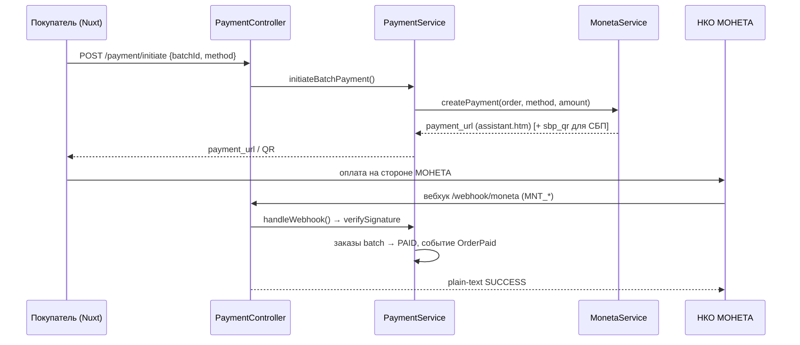

# Платежи (Moneta)

> Как покупатель оплачивает заказ, как деньги попадают на транзитный счёт площадки, как устроены СБП, сохранённые карты и токенизация. Провайдер — НКО МОНЕТА (C2C-маркетплейс).
> Приоритет: **P0** (деньги). Актуально на 2026-07-05.

## Действующие лица

| Актор | Роль |
|---|---|
| **Покупатель** | Оплачивает batch заказов (карта / СБП / сохранённая карта) |
| **Платформа** (`main`) | Формирует подписанный запрос, ловит вебхук, переводит заказ в `PAID` |
| **НКО МОНЕТА** | Платёжная форма `assistant.htm`, транзитный счёт, вебхуки, токены карт |
| **Stub-провайдер** | Эмуляция успеха/отказа в тестовой сборке (`test_mode`) |

## Где что хранится

| Модель / таблица | Что лежит |
|---|---|
| `orders` (`Order`) | `payment_status`, `payment_data`, `moneta_transaction_id`, `moneta_operation_id`, `moneta_status`, `payment_batch_id`, `payment_at` |
| `order_payments` (`OrderPayment`) | `payment_method` (`sbp/card/saved_card`), `amount`, `status`, `transaction_id`, `provider`, `payment_url`, `sbp_qr_url`, `sbp_link`, `saved_card_*`, `paid_at`, `refunded_at` |
| `saved_payment_methods` (`SavedPaymentMethod`) | `type`, `card_mask`, `card_type`, `token` 🔒, `moneta_subscriber_id` 🔒, `is_default`, `expires_at` |

> 🔒 `token` и `moneta_subscriber_id` — в `$hidden`, наружу не отдаются.
> ⚠️ Marketplace-нюанс: МОНЕТА не отдаёт `cardtoken` — для маркетплейса сохранённая карта = `token = "0" + MNT_OPERATION_ID` на подписчика.

## Обзор потока оплаты



## Endpoints

Группа `orders/payment`, контроллер `Api\Orders\PaymentController`.

| Метод | Путь | Метод контроллера | Назначение |
|---|---|---|---|
| `POST` | `/api/orders/payment/initiate` | `initiate()` | Инициировать оплату batch (`sbp` / `card` / `saved_card`) |
| `GET` | `/api/orders/payment/{batchId}/status` | `status()` | Агрегированный статус оплаты batch |
| `GET` | `/api/orders/payment/methods` | `methods()` | Сохранённые способы оплаты пользователя |
| `POST` | `/api/orders/payment/methods` | `addMethod()` | Привязать карту (платёж 1₽ + автовозврат) |
| `DELETE` | `/api/orders/payment/methods/{id}` | `destroyMethod()` | Удалить сохранённый способ |
| `GET`/`POST` | `/api/webhook/moneta` | `webhook()` | Вебхук платежа/привязки; отвечает plain-text `SUCCESS`/`FAIL` |
| `POST` | `/api/webhook/moneta/merchant` | `MonetaMerchantWebhookController` | MerchantAPI (онбординг ЮЛ/ИП) — см. [Выплаты](/business/seller-payouts-flow) |
| `GET`/`POST` | `/api/orders/payment/stub-redirect/{transactionId}` | `StubPaymentController` | Эмулятор формы (только `test_mode`) |

## Слои

`PaymentController` → `PaymentService` (фасад) → `MonetaService` **или** `MonetaStubService` (провайдер, по флагу `use_stub`).

### PaymentService — ключевое

| Метод | Что делает |
|---|---|
| `initiateBatchPayment($batchId, $method, $savedMethodId?)` | создаёт платёж, обновляет `Order` (`moneta_transaction_id/operation_id`, `payment_status=PROCESSING`), пишет `OrderPayment`; возвращает `{payment_url, sbp_qr_url, sbp_link, transaction_id, total_amount}` |
| `handleWebhook($data)` | проверяет подпись, находит заказы по `transaction_id`, переводит в `PAID`, диспатчит `OrderPaid`, при наличии — сохраняет карту |
| `handleBuyerCardBindingWebhook($data)` | сохраняет карту покупателя в `SavedPaymentMethod` (`token = "0"+MNT_OPERATION_ID`), диспатчит `RefundCardBindingPayment` |
| `handleSellerCardBindingWebhook($data)` | пишет `payout_card_token/mask` в `SellerProfile`, диспатчит возврат 1₽ |
| `getBatchPaymentStatus($batchId)` | агрегирует статусы всех заказов batch |

**Диспетчеризация вебхука по `MNT_CUSTOM1`:** нет `card_binding` → обычный платёж; `card_binding_buyer` → карта покупателя; `card_binding_seller` (или legacy `card_binding`) → карта продавца.

### MonetaService — формирование запроса

`createPayment()` собирает подписанный набор `MNT_*` и формирует URL на `/assistant.htm`:

```
MNT_ID, MNT_TRANSACTION_ID (MNT-YYMMDD-XXXXXXXX), MNT_AMOUNT, MNT_CURRENCY_CODE=RUB,
MNT_SUBSCRIBER_ID (buyer_id), MNT_TEST_MODE, MNT_SIGNATURE (MD5),
MNT_SUCCESS_URL / MNT_FAIL_URL / MNT_RESULT_URL, MNT_DESCRIPTION,
MNT_CUSTOM1 = payment_batch_id,
MNT_PAY_SYSTEM = 'sbp'      (только для СБП),
MNT_SAVE_CARD = '1'         (для card / card_binding)
```

- **СБП** — `createSbpInvoice()` через `InvoiceRequest` возвращает NSPK QR (`sbp_qr_url`) и ссылку (`sbp_link`); базовый путь — редирект на `assistant.htm` с `MNT_PAY_SYSTEM=sbp`.
- **Привязка карты** — `createCardBindingPayment($userId, 'buyer'|'seller', 1.0)`: `MNT_SAVE_CARD=1`, `MNT_CUSTOM1="card_binding_{scenario}"`, сумма 1₽ с последующим возвратом (`RefundCardBindingPayment`).
- **Оплата сохранённой картой** — `InvoiceRequest` с `PAYMENTTOKEN` (без `currency`/`paySystem`), редирект на `operationId` + `MNT_SUBSCRIBER_ID` (ввод CVV).
- `verifySignature()` — MD5 от `MNT_ID + MNT_TRANSACTION_ID + MNT_OPERATION_ID + MNT_AMOUNT + MNT_CURRENCY_CODE + MNT_SUBSCRIBER_ID + MNT_TEST_MODE + secret`.
- `formatAmount()` — на `demo.moneta.ru` целое число, на prod `XX.XX`.

### Джоба вебхука

`app/Jobs/ProcessMonetaWebhook.php` — `ShouldQueue` + `ShouldBeUnique` (`uniqueId = moneta-webhook-{MNT_TRANSACTION_ID}`), `tries=3`, `backoff=[10,60]`. Идемпотентность: уникальность по транзакции + проверка повторного `PAID` в `handleWebhook`.

## Тестовый режим

Активен при `config('services.moneta.test_mode') === true` / `use_stub`.

- `MonetaStubService` — реализует `PaymentProviderInterface` без HTTP; `createPayment()` возвращает URL на `stub-redirect/{transactionId}`.
- `StubPaymentController::show()` рисует форму с кнопками **«Оплатить и сохранить карту»** (`succeed_bind`), **«Оплатить»** (`succeed`), **«Отменить»** (`cancel`); `handle()` собирает вебхук-payload и зовёт `handleWebhook()`.

> ⚠️ Известный расхождение demo↔prod: demo-API отклоняет `paySystem` в `InvoiceRequest` (СБП зелёный на моке, но падал в бою) — `createSbpInvoice` сделан non-fatal.

## Как тестировать

**Приоритет P0.** Ключевые проверки:

1. Оплата картой: `initiate(card)` → форма → вебхук `succeed` → заказы batch в `PAID`, взведён `seller_confirmation_deadline`.
2. Отказ: вебхук `cancel` → заказ остаётся `CONFIRMED`, `payment_status=failed`.
3. СБП: `initiate(sbp)` → в ответе `sbp_qr_url`/`sbp_link`.
4. Привязка карты (`succeed_bind`) → запись `SavedPaymentMethod` + возврат 1₽.
5. Оплата сохранённой картой (`saved_card` + `saved_method_id`).
6. Идемпотентность вебхука: повторная доставка не создаёт вторую оплату.
7. Мультизаказ: один `payment_batch_id` на несколько заказов → все в `PAID`.

**Покрытие автотестами:** `tests/Feature/CardPaymentTest.php`, `PaymentTest.php`, `RefundTest.php`, вебхуки (~27). **Пробел:** часть refund-флоу — см. [матрицу покрытия](/testing/coverage-matrix).

## Ключевые файлы

| Область | Файл |
|---|---|
| Endpoints | `main/routes/api.php` (группа `orders/payment`, `webhook/moneta`) |
| Контроллеры | `app/Http/Controllers/Api/Orders/{PaymentController,StubPaymentController}.php`, `Api/Webhook/MonetaMerchantWebhookController.php` |
| Фасад/провайдер | `app/Services/Payment/{PaymentService,MonetaService,MonetaStubService}.php` |
| Джоба | `app/Jobs/ProcessMonetaWebhook.php`, `RefundCardBindingPayment.php` |
| Модели | `app/Models/Order/OrderPayment.php`, `app/Models/SavedPaymentMethod.php`, `app/Models/Order/Order.php` |
| Конфиг | `main/config/services.php` (ключ `moneta`) |
| Тесты | `tests/Feature/{CardPaymentTest,PaymentTest,RefundTest,EndToEndPaymentFlowTest}.php` |

Выплаты продавцу (обратное направление) — отдельный процесс: [Выплаты продавцам](/business/seller-payouts-flow).
