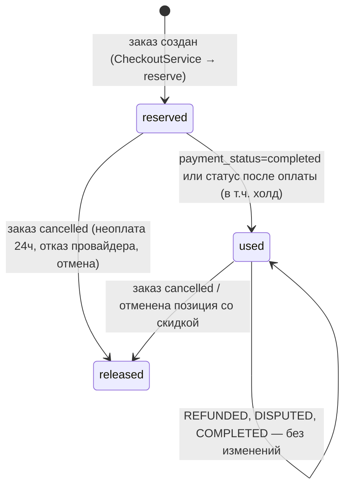

# Промокоды продавцов и отмена позиции заказа

> Техническая справка к страницам [Промокоды продавцов](/overview/promo-codes) и [Заказы → Отмена позиции](/overview/orders#отмена-позиции-заказа): таблицы, модель денег, проверки и их порядок, жизненный цикл применения, эндпоинты, права, отмена позиции и деньги по ней, выкатка.
> Приоритет: **P0** (деньги заказа). Актуально на 2026-10-08.

Две возможности описаны вместе, потому что делят модель денег: обе меняют, **сколько по заказу фактически оплачено**, не трогая начисленные суммы, на которых держатся сверка оплаты и потолки возвратов.

## Действующие лица

| Актор | Роль |
|---|---|
| **Админ / sales-manager** | Ведёт коды (`promo-codes.view` / `promo-codes.manage`), смотрит аналитику; отменяет позицию из админки (`orders.cancel`) |
| **Покупатель** | Проверяет код в корзине, оформляет заказ с кодом; отменяет позицию своего заказа |
| **Продавец** | Платит скидку; отменяет позицию своего заказа |
| **Платформа** (`main`) | `PromoCodeEvaluator`, резерв и синхронизация статуса применения, деление позиции, чек, возвраты |
| **Касса агрегатора** (НКО МОНЕТА, драйвер `bpa`) | Строка чека = позиция заказа; частичное подтверждение холда; `RefundRequest` по операции зачисления строки |
| **Очередь** (VM-2) | `IssueOrderItemRefund`, `IssueOrderRefund`, письма `OrderItemCancelledNotification` |

## Где что хранится

### Промокоды

| Таблица | Ключевые колонки |
|---|---|
| `promo_codes` (`PromoCode`) | `code` string(32) **unique**, хранится нормализованным (trim + верхний регистр, `PromoCode::normalizeCode()`); `name`, `description`; `seller_id` → `users` (**restrict**); `discount_amount` decimal(12,2); `starts_at`, `ends_at` (окончание включительно); `is_active`; `scope` — строка под PHP-enum `PromoCodeScope` (`all_products` / `selected_products`, не `$table->enum`: на PG это CHECK); `usage_limit` null = без лимита; `created_by` / `updated_by` (nullOnDelete). Индексы `seller_id`, `(is_active, starts_at, ends_at)` |
| `promo_code_product` | пара FK `promo_code_id` / `product_id` с каскадом, unique пары, индекс `product_id`. Используется только при `scope = selected_products` |
| `promo_code_redemptions` (`PromoCodeRedemption`) | одна строка на заказ с кодом: `promo_code_id` (**restrict** — код с историей не удалить), `user_id`, `seller_id`, `order_id` **unique**, `order_item_id` (строка со скидкой), `payment_batch_id`; **снимок** `code`, `unit_price`, `discount_amount`, `price_after_discount`; `status` (`PromoRedemptionStatus`: `reserved` / `used` / `released`), `reserved_at`, `used_at`, `released_at`, `release_reason` (`payment_failed` / `unpaid` / `order_cancelled` / `item_cancelled`). Индексы `(promo_code_id, status)`, `(promo_code_id, reserved_at)`, `user_id`, `seller_id` |

**Частичный уникальный индекс** `promo_redemptions_active_user_unique` — `(promo_code_id, user_id) WHERE status IN ('reserved','used')`, создаётся `DB::statement` (в Blueprint частичных индексов нет; синтаксис одинаков для PostgreSQL и SQLite в тестах). Держит в базе «один пользователь — одно активное применение» и отбивает параллельное оформление двух заказов с одним кодом. Освобождённые применения не мешают применить код снова.

Статус кода в списке (`PromoCodeListStatus`) **не хранится** — `PromoCode::listStatus()` по приоритету: `finished` (срок вышел) → `paused` (`is_active = false`) → `exhausted` (активных применений ≥ `usage_limit`) → `scheduled` (не начался) → `active`. Фильтр списка переводит его в SQL в том же приоритете (`PromoCodeController::filterByStatus`).

### Деньги заказа

| Колонка | Смысл |
|---|---|
| `order_items.unit_price` | цена за штуку **до** скидки |
| `order_items.promo_discount` | скидка на строку; инвариант `promo_discount > 0 ⇒ quantity = 1` (`LogicException` в `OrderItem::saving`) |
| `order_items.total_price` | `round(qty × unit_price − promo_discount, 2)` — хук `OrderItem::saving` (dirty по трём полям); фактическая стоимость строки |
| `orders.subtotal` | Σ `total_price` = товары **после** скидки |
| `orders.promo_discount` | скидка заказа; «Товары до скидки» = `Order::subtotalBeforeDiscount()` = `subtotal + promo_discount` |
| `orders.total_amount` | начисленная сумма к оплате (`subtotal + delivery_cost`, хук `Order::creating`); **после оплаты не меняется** |
| `orders.cancelled_items_amount` | Σ `total_price` строк, отменённых до отправки |
| `order_items.cancelled_at` / `cancelled_by` / `cancel_initiator` (`buyer`/`seller`/`admin`) / `cancel_reason` (≤ 500) | отмена позиции; строка не удаляется — остаётся в истории и в счёте |
| `order_refunds.order_item_id` | возврат за отменённую позицию; null — возврат по заказу. Ставится при создании записи возврата, **до** обращения к провайдеру |

`Order::netTotal()` = `total_amount − cancelled_items_amount`, `Order::netSubtotal()` = `subtotal − cancelled_items_amount`, `OrderItem::paidUnitPrice()` = `unit_price − promo_discount` (у строки со скидкой) или `unit_price`.

## Модель денег

**Скидка.** Так как `subtotal` хранится после скидки, без отдельных правок сходятся комиссия (`Order::calculatePlatformFeeFor`, `stampFiscalRates`), `total_amount`, сумма счёта, чек, потолок возврата и выплата (`SellerSettlementService::sellerAmount`, выписки НКО). Строка чека со скидкой (`InventoryBuilder::productLine`): `productPrice = paidUnitPrice()`, количество 1. Если у строки со скидкой qty ≠ 1 — `InventoryBuildException::promoDiscountOnMultipleUnits`.

**Деление позиции.** Скидка — на одну единицу, а строка чека — цена за штуку × целое количество. Поэтому `CheckoutService::createOrderItems()` делит выбранную позицию 2+ шт. на две строки одного товара: **1 шт. со скидкой (создаётся первой) + остаток** по полной цене. `sku` при оформлении пуст, уникальный ключ `(order_id, product_id, sku)` дубль товара допускает. Склад списывается один раз на всю позицию (`decreaseStockAtomically(qty)`). Последствия деления, учтённые в коде:

- `CheckoutService::itemsFingerprint()` (антидубль) **суммирует количество по `product_id`** — иначе заказ из двух строк не совпал бы с корзиной из одной;
- `CdekPackageItems::fromOrderItems()` — одна строка посылки на товар, количество суммируется, отменённые позиции пропускаются; объявленная стоимость — каталожная `unit_price`;
- `OrderReviewService::targets` — одна карточка отзыва на товар; `OrderResource.items_count` и уведомления о новом заказе считают **штуки**;
- `CreateOrdersRequest`: `orders.*.items.*.product_id` — `distinct` (товар один раз на оформление).

**Отмена позиции.** Начисленные `subtotal`, `total_amount`, `promo_discount` после оплаты не меняются. Растёт `cancelled_items_amount`, `fee_amount` пересчитывается от `netSubtotal()` (`PricingCalculator::platformFee` с `payment_method_locked`), `sellerAmount` берёт `netSubtotal()`, холд списывает `netTotal()`.

## Промокод: проверка

`App\Services\Promo\PromoCodeEvaluator::evaluate($buyer, $rawCode, $candidates, lockForUpdate, throttleMisses)` → `PromoEvaluation` (код, продавец, товар, цена, скидка) или `PromoRejection` (`reason` + текст). Единая точка для корзины, предрасчёта и создания заказа. Ничего не пишет.

Порядок проверок (ТЗ п. 5):

| # | Проверка | `reason` | Текст |
|---|---|---|---|
| 0 | лимит промахов (только при `throttleMisses`) | `too_many_attempts` | «Слишком много попыток ввода промокода. Попробуйте позже.» |
| 1 | код существует | `not_found` | «Промокод не найден.» |
| 2 | `is_active` | `inactive` | «Промокод сейчас не действует.» |
| 3 | начался | `not_started` | «Промокод начнёт действовать {dd.mm.YYYY HH:ii} МСК.» |
| 4 | не истёк (окончание включительно) | `expired` | «Срок действия промокода закончился.» |
| 5 | общий лимит: активных (`reserved` + `used`) < `usage_limit` | `limit_reached` | «Лимит использования промокода исчерпан.» |
| 6 | у покупателя нет активного применения | `already_used` / `reserved_elsewhere` | «Вы уже использовали этот промокод.» / «Промокод уже применён к неоплаченному заказу № … Оплатите или отмените его, чтобы использовать код снова.» |
| 7 | есть товары продавца кода | `not_applicable` | «Промокод не действует на товары в вашей корзине.» |
| 8 | есть товары в области действия | `not_applicable` | то же |
| 9 | есть товары без другой скидки (`OtherDiscountChecker`) | `only_discounted` | «Промокод нельзя применить к товарам, на которые уже действует скидка.» |
| 10 | выбранный товар: цена − скидка ≥ `marketplace.promo.min_price_after_discount` (1 ₽) | `exceeds_price` | «Скидка по промокоду больше стоимости товара.» |

Успех — «Промокод применен. Скидка 500 ₽.» (`PromoEvaluation::message()`).

**Выбор товара** — `compareCandidates()`: дороже → раньше добавлен в корзину (`cart_items.created_at`) → меньший `cart_items.id` → меньший `product_id`; товары не из корзины («Купить» мимо корзины) — после всех из корзины. Кандидатов строит `PromoCandidate::fromItems()`. Проверка «цена ≥ 1 ₽» делается только у выбранного — остальные дешевле.

**Другие скидки** — контракт `App\Contracts\Promo\OtherDiscountChecker`, привязка в `AppServiceProvider` к `NoOtherDiscounts` (всегда `false`): других скидок на площадке сейчас нет, это заготовка.

## Промокод: жизненный цикл применения

`App\Services\Promo\PromoRedemptionService`:

- `reserve()` — внутри транзакции оформления, после блокировки строки кода;
- `syncWithOrder(Order)` — вызывается **хуком `Order::updated`** при `wasChanged(['status','payment_status'])`. Хук, а не слушатели событий: часть отмен (`CancelUnpaidOrders`, canceled-ветка `PaymentService::applyProviderState`, сырая смена статуса админом) событий не бросает, а через `$order->update()` проходят все. Применение ищется по `order_id`. `status = cancelled` → `released` с причиной по `payment_status` (`failed` → `payment_failed`, `cancelled` → `unpaid`, иначе `order_cancelled`); `payment_status = completed` или статус из PAID…REFUNDED → `used`. Выход из `cancelled` сырым статусом — `Log::critical` «Промокод: заказ выведен из отмены, применение уже освобождено», резерв не воскрешается. Работает в транзакции вызывающего, исключений наружу не бросает (`Log::error`);
- `releaseForItem(OrderItem)` — отмена позиции со скидкой, `release_reason = item_cancelled`;
- `hasActiveReservation()` — гейт `PaymentService::initiateBatchPayment`: заказ с `promo_discount > 0` без живого резерва не оплачивается («Промокод по заказу больше не действует. Отмените заказ и оформите его заново», `Log::critical`). Срок кода здесь не перепроверяется — условия зафиксированы при оформлении.

Переходы — условным `UPDATE … WHERE status IN (…)` (compare-and-set): повторный вызов, поздний коллбек или гонка не сдвинут статус дважды; `used_at` при освобождении сохраняется.

Отказ платежа **без** отмены заказа оставляет `reserved` — заказ можно оплатить снова. Возврат (RMA) после получения и спор применение не освобождают.

## Промокод: корзина, предрасчёт, оформление

| Метод | Путь | Контроллер | Что делает |
|---|---|---|---|
| `POST` | `/api/cart/promo-code/evaluate` | `Api\CartPromoCodeController::evaluate` | проверка в корзине. Группа корзины (`auth:web`, `EnsureRealEmailApi`), `throttle:20,1`. Тело (`EvaluatePromoCodeRequest`): `code` (≤ 64), `items: [{product_id, quantity}]` (≤ 100, `distinct`). Берёт только активные товары с достаточным остатком. Ответ **всегда 200**: `{success, data: {code, applied, reason, message, discount, seller_id, product_id, unit_price, price_after_discount}}`; гость — 401, троттлинг — 429. Ничего не резервирует |
| `POST` | `/api/orders/checkout/preview` | `CheckoutController::preview` → `CheckoutService::previewOrders(..., ?promoCode)` | предрасчёт. Отказ кода → issue `promo_code_rejected` (`can_checkout = false`) + блок `promo` (как в ответе корзины). У заказов — `promo_discount`, `subtotal_before_discount`, `subtotal` (после скидки), `total_amount`; у позиций — `promo_discount` и `total_price` после скидки; в корне — `subtotal_before_discount`, `promo_discount`, `promo`. Считает промахи (`throttleMisses: true`) |
| `POST` | `/api/orders/checkout` | `CheckoutController::process` → `CheckoutService::createMultipleOrders(..., ?promoCode, ?promoExpectedDiscount)` | создание заказов. Поля `promo_code` (nullable, ≤ 64) и `promo_expected_discount` (скидка, показанная покупателю). Промахи считает предварительная проверка (до транзакции); перепроверка под блокировкой — нет |

Порядок в `createOrdersUnderLock()` (под замком `checkout:buyer:{id}`):

1. разбор заказов продавцов (`resolveSellerOrder`) → проверка кода без блокировки по валидным позициям; отказ — в общий список `issues` (`422`, покупатель видит все проблемы разом);
2. антидубль `assertNoDuplicateCheckout()` (отпечаток суммирует количество по товару);
3. транзакция: **первой операцией** — повторная проверка с `PromoCode::lockForUpdate()` (два покупателя на последнее место лимита выстраиваются в очередь; порядок блокировок «код → товары» один на все оформления) и сверка с `promo_expected_discount`: скидка **уменьшилась** → `422` issue `promo_discount_changed` («Скидка по промокоду изменилась: 500 → 300 ₽. Проверьте заказ.»);
4. для заказа продавца кода: `subtotal = Σ − скидка`, `fee_amount` от него, `createOrderItems()` (строка со скидкой первой, деление qty > 1), `reserve()`;
5. `UniqueConstraintViolationException` частичного индекса → `CheckoutValidationException` с `promo_code_rejected` / `reserved_elsewhere` (иначе контроллер отдал бы 400 с текстом SQL). Заказ не создан, остаток и корзина не тронуты.

Скидка — только в заказе продавца кода; остальные заказы батча — без скидки. Один код на оформление.

**Фронт.** `nuxt/stores/cart.ts`: `promoCode`, `promoResult`, `promoSelectionKey`, `promoSeq`; `applyPromo` / `refreshPromo` / `removePromo`; код персистится в `localStorage` (`cart-promo-code`); скидка показывается, только если ключ оценки совпадает с текущим выбором (`selectionKey`), устаревшие ответы отбрасываются по `promoSeq`. Гостю запрос не шлётся — код сохраняется до входа. `components/cart/PromoCodeField.vue` — поле, замена кода через `UiMzModal`, ошибки предрасчёта (`promo_code_rejected` / `promo_discount_changed`) показываются у поля. `useCheckout.ts` кладёт `promo_code` и `promo_expected_discount` в payload и сбрасывает код после созданного заказа.

## Промокод: админка

Маршруты в админ-группе (`/api/admin/promo-codes`), мутации пишут журнал действий (`admin.activity.logger`), GET — без логгера. Формат ответов — `{data, meta, links}` / `{data, message}` / `{message}`.

| Метод | Путь | Право | Что делает |
|---|---|---|---|
| `GET` | `/` | `promo-codes.view` | список: `search` (код/название, `ilike` на PG), `seller_id`, `status` (`PromoCodeListStatus`), сортировка, `per_page ≤ 100`; к строкам — `list_stats` (`used`, `reserved`, `active`, `discount_sum`) одним запросом |
| `GET` | `/lookup/sellers`, `/lookup/products` | `promo-codes.view` | подбор продавца (`is_seller`) и его товаров для формы, лимит 20 |
| `POST` | `/` | `promo-codes.manage` | создание (`StorePromoCodeRequest`) |
| `GET` | `/{id}` | `promo-codes.view` | карточка |
| `GET` | `/{id}/analytics` | `promo-codes.view` | метрики за период `date_from` / `date_to` |
| `GET` | `/{id}/redemptions` | `promo-codes.view` | история применений, фильтр `status` |
| `PUT` | `/{id}` | `promo-codes.manage` | правка (`UpdatePromoCodeRequest`) |
| `DELETE` | `/{id}` | `promo-codes.manage` | удаление |

Валидация: код `^[A-Z0-9_-]{3,32}$` после нормализации, уникален; `seller_id` — существующий `is_seller`; `discount_amount` — целое 1…1 000 000; обе даты обязательны, `ends_at > starts_at`; `usage_limit` ≥ 1 или null; `product_ids` обязателен при `selected_products` (≤ 500). Даты приходят с поясом (форма — МСК) и пишутся в UTC (`PromoCodeAdminService::attributes`).

`PromoCodeAdminService`:

- `update()` — в транзакции под `lockForUpdate` строки кода (та же блокировка, что у оформления). После первого применения закрыты `code`, `seller_id`, `discount_amount` (`LOCKED_AFTER_USE`, `422` «Промокод уже применялся — это поле изменить нельзя…»); смена продавца до применений чистит выбранные товары;
- `syncProducts()` — только товары продавца кода, иначе `422`; при `all_products` список очищается;
- `delete()` — только без применений, иначе `422` «Промокод уже использовался — его можно только деактивировать.» (FK `restrict` страхует).

**Аналитика** — `PromoCodeAnalytics::summary()`: период по `reserved_at`, границы дней по `Europe/Moscow`, переведённые в UTC; агрегаты через `SUM(CASE …)` (без `FILTER` — ради SQLite).

| Поле | Определение |
|---|---|
| `applications` | все применения за период |
| `unique_users` | `COUNT(DISTINCT user_id)` |
| `paid_orders` | `used_at IS NOT NULL` (включая позже освобождённые) |
| `completed_orders` | `status = used` и заказ `completed` |
| `cancelled_orders` | `status = released` |
| `reserved_now` | `status = reserved` |
| `discount_sum` | Σ `discount_amount` при `status = used` |
| `gmv_before_discount` / `gmv_after_discount` | Σ `(subtotal − cancelled_items_amount) + discount_amount` / Σ `(subtotal − cancelled_items_amount)` при `status = used` |
| `average_check` / `average_discount` | Σ `(total_amount − cancelled_items_amount)` / `discount_sum`, делённые на число `used` |

**Права.** `promo-codes.view`, `promo-codes.manage` (модуль `promo`) выдаются ролям `admin` и `sales-manager` **миграцией** `2026_10_08_000400_add_promo_codes_permissions` (только добавляет связи, не трогает правленные руками права; сбрасывает кеш `user.{id}.permissions`) и тем же набором в `RolesAndPermissionsSeeder`. `super-admin` — через `Gate::before`. Фронт: пункт «Промокоды» в `layouts/admin.vue` по `promo-codes.view`, метка модуля в `components/admin/PermissionsMatrix.vue`, страницы `pages/admin/promo-codes/{index,new,[id]}.vue` (вкладки «Настройки / Аналитика / Применения»), компоненты `components/admin/promo/*`, `composables/useAdminPromoCodes.ts`.

## Защита от перебора

- `throttle:20,1` на `/api/cart/promo-code/evaluate` (по пользователю/IP, `429`).
- Лимит промахов «код не найден» на пользователя: `RateLimiter` с ключом `promo-miss:{user_id}`, `marketplace.promo.miss_limit` (10) за `marketplace.promo.miss_decay_seconds` (600 с). Считают корзина, предрасчёт и предварительная проверка оформления (иначе оформление — обход лимита). Один и тот же код считается **одним** промахом в окне (метка `promo-miss:{user_id}:{sha1(code)}` в кеше): предрасчёт повторяет проверку сохранённого кода при каждой смене доставки и иначе исчерпал бы лимит сам. Дальше — `too_many_attempts`.
- Оформление само по себе — `throttle:12,1`.

## Отмена позиции

### Эндпоинты

| Метод | Путь | Кто | Ответ |
|---|---|---|---|
| `POST` | `/api/orders/{order}/items/{orderItem}/cancel` | покупатель или продавец заказа (`OrderPolicy::cancelItem`; чужой — `403`) | `{success, message: 'Позиция отменена', data: OrderResource}` |
| `POST` | `/api/admin/orders/{id}/items/{itemId}/cancel` | `can:orders.cancel` (admin, sales-manager), журнал админки | `{data: Admin\OrderResource, message}` |

Тело — `reason` (обязательна, ≤ 500; `CancelOrderItemRequest`). Обе ручки вызывают сервис **под `OrderService::withDecisionLock()`** — тот же замок `orders:{id}:decision`, что у полной отмены, продления ожидания и автоотмены по срокам.

### Правила (`OrderItemCancellationService::assertCancellable`)

| Нарушение | Ответ |
|---|---|
| позиция из другого заказа | `422` «Позиция не относится к этому заказу» |
| уже отменена | `422` «Позиция уже отменена» |
| `pricing_model ≠ bpa_v2` | `422` «Для этого заказа доступна только отмена целиком» |
| статус не `PAID`/`PROCESSING`, `shipped_at` не пуст или `payment_status ≠ completed` | `422` «Отменить позицию можно только у оплаченного заказа, который ещё не передан перевозчику» |
| холд в `settling` | `409` «Сейчас проходит списание оплаты — попробуйте через минуту» |
| активных строк < 2 | `422` «Это последняя позиция заказа — отмените заказ целиком» |

Флаг для интерфейса — `Order::canCancelItems()` → `can_cancel_items` в `OrderResource` (только при загруженных `items`).

### Что делает сервис

`OrderItemCancellationService::cancel(order, item, actor, initiator, reason)`:

1. **Транзакция**: `lockForUpdate` заказа и строки → проверки → поля отмены строки → `cancelled_items_amount += total_price` → `fee_amount` = `netSubtotal()` × `commission_rate` заказа (ставка зафиксирована при оплате; без неё — по конфигу) → `product->increaseStock(qty)` → при скидке на строке `PromoRedemptionService::releaseForItem()` → запись в `order_status_history` (тот же статус, комментарий «Отменена позиция «…» (кто): причина»).
2. **После коммита — деньги** (`releaseMoney`):
   - холд не списан (`OrderPayment::isAuthorizedNotCaptured()`) — ничего не делаем: строка выпадет из подтверждения;
   - деньги списаны (СБП) — `IssueOrderItemRefund::dispatch(itemId, actorId, reason)`;
   - нет `moneta_operation_id` — warning, возврата нет.
3. Событие `OrderItemCancelled` → слушатель `SendOrderItemCancelledNotification` (event discovery) → `OrderItemCancelledNotification` (`channelsFor(..., 'orders', emailFallback: true)`, шаблон `emails/orders/item-cancelled.blade.php`): покупателю — всегда (сумма и «вернутся в течение 3–7 рабочих дней» / «не будут списаны с карты»), продавцу — если отменил не он («Не кладите её в посылку»).

Заявка СДЭК не меняется: метода изменения заявки у СДЭК нет, а пересоздание делает недействительным распечатанный продавцом ярлык. Если заявку всё же пересоздают (`createCdekShipment`), `CdekPackageItems` пропускает отменённые позиции.

### Холд картой: частичное подтверждение

`PaymentHoldService`:

- `buildPlan()` — подтверждённый заказ даёт в списание `netTotal()`; id отменённых строк собираются в `excluded_item_ids`. При отменённых строках подтверждение всегда частичное (с суммой), даже если по сумме совпало бы с авторизованным;
- `partialInventory()` — номенклатура из выставленного счёта: `forOrders(confirmed)` → `InventoryBasket::withoutOrderItems(excluded)`;
- `captured_amount = netTotal()`;
- `reconcileWithProvider()` — если провайдер списал всё, `captured_amount = total_amount` (фактически списанное), а отменённые позиции добираются возвратом: `IssueOrderItemRefund` на каждую («Холд не удержан провайдером: возврат отменённой позиции»).

**Потолок возвратов** — `Order::chargedAmount(payment)`: при списанном холде — `captured_amount`, иначе `total_amount`. От него считаются `RefundService::refundOrder` (максимум к возврату и признак полного возврата → `REFUNDED`) и «Можно вернуть» в сверке. Без этого после частичного подтверждения полный RMA не переводил бы заказ в «возвращён», а админка предлагала бы вернуть несписанное. Если состав возврата не передан, строки подбираются по сумме **без** строк отменённых позиций.

`PaymentService::applyProviderState` — сверка суммы (`assertAmountMatches`) выполняется, только если хоть один заказ ещё ждёт перехода в оплату. Повторный «оплачен» после частичного подтверждения приходит с меньшей (списанной) суммой и раньше падал бы на сверке.

### СБП: возврат строки

`App\Jobs\IssueOrderItemRefund` — уникален на строку (`uniqueId = item:{id}`, `uniqueFor` 3600), 3 попытки с backoff 60/300/900 с. Отдельный от `IssueOrderRefund` джоб: тот уникален на заказ, и второй возврат по заказу в пределах часа молча потерялся бы.

- пропускает, если строка не отменена или по ней уже есть `succeeded`-возврат;
- если по строке висит `pending`-заявка (прошлая попытка оборвалась, исход у провайдера неизвестен) — второй возврат не создаёт, пишет `Log::critical`: решает человек по выписке;
- корзина = строки счёта этой позиции: `PaymentInvoice::inventoryBasket()->forOrders([order])->forOrderItems([item])`, сумма — её итог (оплаченная цена, с учётом скидки);
- `RefundService::refundOrder(..., updateOrderStatus: false, basket, orderItemId)` — `order_refunds.order_item_id` пишется сразу; `RefundRequest` идёт по операции зачисления этой строки (`MZ{order}I{item}`), то есть **со счёта продавца**;
- `failed()` → `Log::critical` «IssueOrderItemRefund: деньги за отменённую позицию не возвращены».

### Полная отмена после отмены позиции

`IssueOrderRefund`: если у заказа есть отменённые строки — сумма = `netTotal()` − успешные возвраты **по заказу** (`order_item_id IS NULL`), корзина — строки счёта без отменённых позиций (`withoutOrderItems`) + доставка. Деньги отменённых строк второй раз не возвращаются, даже если их собственный возврат ещё в работе. Если остаток не совпадает со строками (были частичные возвраты) — warning, строки подбирает `RefundService` по сумме, тоже без отменённых позиций.

**Повтор возвратов** — `App\Jobs\RetryCancelledItemRefunds`, раз в час (`routes/console.php`): отменённые 30 мин – 30 дней назад позиции, деньги за которые списаны (платёж без живого холда и `chargedAmount = total_amount`), без `succeeded`/`pending`-возврата → снова `IssueOrderItemRefund` («Повтор возврата за отменённую позицию»). Страхует от сбоя очереди и от исчерпанных трёх попыток.

Отменённые строки пропускаются везде, где заказ обходит позиции: возврат склада в `OrderService::performCancellation`, `CancelUnpaidOrders`, canceled-ветка `applyProviderState`; `ReturnEligibilityService`, `OrderReturn::isFullReturn`, `ReturnService::attachItem` (отменённую вернуть нельзя), `RefundPlanner` (при отменённых строках полный возврат идёт явной корзиной); `OrderReviewService`; `SellerStatisticsController`; письмо `order-summary.blade.php` (строка «· отменена», итог — `netTotal()`) и `OrderWaitActionResource`. `InventoryBuilder::linesForOrder` бросает `InventoryBuildException::cancelledItemInUnpaidOrder`, если у неоплаченного заказа есть отменённая строка.

Возврат после получения (RMA) по позиции со скидкой — по `paidUnitPrice()` (`ReturnService::attachItem`; в `eligibility` новое поле `refund_unit_price`).

### Ресурсы

- `OrderItemResource`: `promo_discount`, `paid_unit_price`, `is_cancelled`, `cancelled_at`, `cancel_initiator`, `cancel_reason`, `refund_status` (`not_charged` — холд; `refund_pending` / `refunded` / `refund_failed` — по `items.refunds`).
- `OrderResource` / `Admin\OrderResource`: `subtotal_before_discount`, `promo_discount`, `cancelled_items_amount`, `net_total`, `refunded_amount` (Σ успешных возвратов, при загруженных `refunds`), `can_cancel_items`, блок `promo {code, discount, order_item_id, status, status_label}` (в админке ещё снимок цен, даты и причина освобождения).

Фронт: общий `components/Orders/CancelItemModal.vue` (причина с вариантами, текст про деньги по `payment.is_authorized_not_captured`, предупреждение о скидке), `components/Orders/OrderItemNotes.vue` (пометки строки), `useOrders.cancelOrderItem`, `useAdminOrders.cancelOrderItem`; карточки `pages/profile/orders/[id].vue`, `components/seller/OrderDetailContent.vue` + `OrderDetailInfo.vue`, `pages/admin/orders/[id].vue`.

### Сверка

`SellerFinanceAnomalies` — тип `cancelled_items_not_refunded` «Позиция отменена, деньги покупателю не возвращены»: по выписке (`seller_ledger_entries`, `source = statement`) у строк с `cancelled_at` старше 1 ч сумма проводок > 0 в неотменённом заказе. В деталях — текст последней упавшей попытки возврата и пометка, что повтор идёт автоматически раз в час. Кнопки ручного возврата у этой аномалии нет намеренно: общий возврат по заказу подбирает строки счёта по сумме и мог бы вернуть не ту позицию, а остаток по выписке — за вычетом комиссии НКО. Закрывается отметкой «разобрано». При холде строка не списывается вовсе — проводок нет, проверка молчит; полностью отменённые заказы разбирает `cancelled_not_refunded`.

## Что делать, если пошло не так

| Ситуация | Поведение | Кто чинит |
|---|---|---|
| Покупатель жалуется «код не применяется» | смотреть `reason` в ответе корзины / предрасчёта и статус кода в админке; активное применение покупателя — вкладка «Применения» | поддержка |
| Код «застрял» в резерве у неоплаченного заказа | освобождается отменой заказа (покупателем или автоотменой через 24 ч) | покупатель / автоматически |
| В логе `Промокод: заказ выведен из отмены, применение уже освобождено` | заказ после отмены возвращён сырым статусом; скидка в заказе без активного применения, оплатить его не дадут (`hasActiveReservation`) | разработчики: решить по заказу вручную |
| `PaymentService: заказ со скидкой без резерва промокода` | оплата отклонена: «Промокод по заказу больше не действует…» | покупатель: отменить и оформить заново |
| `Промокод: не удалось синхронизировать применение с заказом` | статус применения отстал от заказа; оплата/отмена не пострадали | разработчики: поправить статус применения |
| `IssueOrderItemRefund: деньги за отменённую позицию не возвращены` + аномалия `cancelled_items_not_refunded` | возврат строки упал после 3 попыток | автоматически: `RetryCancelledItemRefunds` раз в час; если по строке висит `pending`-заявка — финансы сверяют её с выпиской и закрывают вручную |
| Отмена позиции отвечает `409` | холд как раз списывается | повторить через минуту |
| Провайдер списал холд целиком, несмотря на отменённую позицию | `reconcileWithProvider` ставит `IssueOrderItemRefund` на каждую отменённую строку | автоматически |

## Как тестировать

Ручные сценарии — на страницах [Промокоды продавцов](/overview/promo-codes#сценарии-тестирования) и [Заказы](/overview/orders#сценарии-тестирования).

**Автотесты** (Pest, `main/`; гонять по путям файлов, `--filter` ломается из-за дубля хелперов):

| Файл | Что покрыто |
|---|---|
| `tests/Feature/Promo/PromoCodeEvaluatorTest.php` (19) | порядок проверок и тексты, регистр, «весь магазин» динамически, выбор самого дорогого и ничья по цене, другие скидки, порог 1 ₽, лимит промахов (повтор одного кода — один промах) |
| `tests/Feature/Promo/PromoCheckoutTest.php` (13) | предрасчёт и issue, промахи при оформлении, деление qty 3, антидубль 409, истёкший код между предрасчётом и оформлением, лимит 1, частичный индекс, `promo_discount_changed`, `distinct`, комиссия от суммы после скидки |
| `tests/Feature/Promo/PromoRedemptionLifecycleTest.php` (9) | RESERVED → USED (в т.ч. холд), отказ провайдера, отказ без отмены, `CancelUnpaidOrders`, отмена продавцом, возврат/спор/завершение, выход из отмены, гейт оплаты без резерва |
| `tests/Feature/Promo/PromoMoneyFlowTest.php` (7) | чек без остатка округления, инвариант qty = 1, RMA по оплаченной цене, СДЭК по строке на товар, отзывы без дублей, уведомления, карточка заказа |
| `tests/Feature/Promo/CartPromoEvaluateTest.php` (5) | 401 гостю, 200 с отказом, снятый товар, 429 |
| `tests/Feature/Promo/AdminPromoCodeTest.php` (11) | права (sales-manager — да, support/content — нет), нормализация и даты МСК→UTC, уникальность без регистра, чужие товары, смена продавца без нового списка товаров, закрытые поля, удаление, пять статусов, аналитика с периодом, подбор, миграция прав |
| `tests/Feature/Orders/OrderItemCancellationTest.php` (21) | холд и СБП, частичное подтверждение без строки, отмена позиции с/без промокода, полная отмена после позиции, запреты (последняя, отправлен, не оплачен, legacy, чужой, `settling`, без причины), админ и поддержка, RMA без отменённой, поздний «оплачен» (операция не переписана), аномалия сверки, потолок возврата после частичного списания, ежечасный повтор, без дубля при `pending`, комиссия по ставке заказа |
| `nuxt/tests/unit/stores/cartPromo.test.ts` (10) | логика промокода в сторе корзины (Vitest) |

Регресс после изменений модели денег: `tests/Feature/Orders/CheckoutGuardsTest.php`, `Payment/BpaCheckoutFlowTest.php`, `BpaHoldSettlementTest.php`, `BpaRefundTest.php`, `ReturnFlowTest.php`, `Orders/CardHoldFlowTest.php`, `IssueOrderRefundJobTest.php`, `Unit/Payment/InventoryBuilderTest.php`, `EndToEndPaymentFlowTest.php`, `Admin/AdminApiFormatTest.php`, `PlatformFeeTest.php`, `SellerSettlementTest.php`.

## Выкатка

1. **Миграции** (5 файлов `database/migrations/2026_10_08_*`):
   - `000100_create_promo_codes_table` — `promo_codes` + `promo_code_product`;
   - `000200_create_promo_code_redemptions_table` — применения + частичный уникальный индекс;
   - `000300_add_promo_discount_to_orders_and_order_items`;
   - `000400_add_promo_codes_permissions` — права разделу ролям admin и sales-manager;
   - `000500_add_item_cancellation_to_orders` — поля отмены в `order_items`, `orders.cancelled_items_amount`, `order_refunds.order_item_id`.

   `ADD COLUMN … DEFAULT 0` на PostgreSQL меняет только метаданные — таблицы не переписываются.
2. **Деплой VM-1 и VM-2.** На VM-2 воркеры выполняют `IssueOrderItemRefund`, письма об отмене позиции и проводят оплату (хук `Order::updated` → `used`) — без обновления их кода возвраты строк не пойдут.
3. **Env.** Новых обязательных переменных нет. Необязательные (дефолты в `config/marketplace.php → promo`): `PROMO_MIN_PRICE_AFTER_DISCOUNT` (1), `PROMO_MISS_LIMIT` (10), `PROMO_MISS_DECAY_SECONDS` (600).
4. Фича «спит», пока админ не создаст первый код. Отмена позиции доступна сразу для оплаченных неотправленных заказов кассы агрегатора.

## Ключевые файлы

| Область | Файл |
|---|---|
| Модели и enum | `app/Models/Promo/{PromoCode,PromoCodeRedemption}.php`, `app/Enums/{PromoCodeScope,PromoRedemptionStatus,PromoCodeListStatus}.php`, `app/Models/Order/{Order,OrderItem,OrderRefund}.php` |
| Проверка и цикл | `app/Services/Promo/{PromoCodeEvaluator,PromoRedemptionService,NoOtherDiscounts}.php`, `app/Contracts/Promo/OtherDiscountChecker.php`, `app/Support/Promo/{PromoCandidate,PromoEvaluation,PromoRejection}.php` |
| Админка | `app/Services/Promo/{PromoCodeAdminService,PromoCodeAnalytics}.php`, `app/Http/Controllers/Admin/{PromoCodeController,PromoCodeLookupController}.php`, `app/Http/Requests/Admin/{Store,Update}PromoCodeRequest.php`, `app/Http/Resources/Admin/{PromoCodeResource,PromoCodeRedemptionResource}.php` |
| Корзина и оформление | `app/Http/Controllers/Api/CartPromoCodeController.php`, `app/Http/Requests/Cart/EvaluatePromoCodeRequest.php`, `app/Services/Order/CheckoutService.php` (`previewOrders`, `createOrdersUnderLock`, `createOrderItems`, `itemsFingerprint`), `app/Http/Requests/Order/CreateOrdersRequest.php` |
| Отмена позиции | `app/Services/Order/OrderItemCancellationService.php`, `app/Http/Controllers/Api/Orders/OrderItemCancellationController.php`, `app/Http/Controllers/Admin/OrderController.php` (`cancelItem`), `app/Http/Requests/Order/CancelOrderItemRequest.php`, `app/Exceptions/OrderItemCancellationException.php`, `app/Policies/OrderPolicy.php` |
| Деньги | `app/Jobs/{IssueOrderItemRefund,IssueOrderRefund}.php`, `app/Services/Payment/{PaymentHoldService,InventoryBuilder,PaymentService,RefundService,RefundPlanner}.php`, `app/Support/Payment/Inventory/InventoryBasket.php`, `app/Services/Seller/{SellerSettlementService,SellerFinanceAnomalies}.php` |
| Уведомления | `app/Events/OrderItemCancelled.php`, `app/Listeners/SendOrderItemCancelledNotification.php`, `app/Notifications/OrderItemCancelledNotification.php`, `resources/views/emails/orders/item-cancelled.blade.php`, `resources/views/emails/components/order-summary.blade.php` |
| Доставка | `app/Support/Order/CdekPackageItems.php` |
| Маршруты, конфиг | `routes/api.php` (`cart/promo-code/evaluate`, `orders/{order}/items/{orderItem}/cancel`, `admin/orders/{id}/items/{itemId}/cancel`, `admin/promo-codes`), `config/marketplace.php → promo` |
| Фронт | `nuxt/stores/cart.ts`, `nuxt/components/cart/PromoCodeField.vue`, `nuxt/composables/useCheckout.ts`, `nuxt/pages/{cart,checkout}.vue`, `nuxt/components/Orders/{CancelItemModal,OrderItemNotes}.vue`, `nuxt/pages/admin/promo-codes/*`, `nuxt/components/admin/promo/*`, `nuxt/types/promo.ts` |
